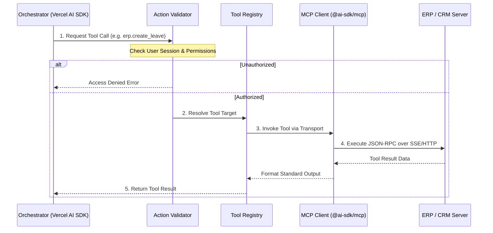

# Layer 5 — Integration Layer (MCP & API Adapter)

> **Mục tiêu**: Hướng dẫn chi tiết thiết kế và triển khai Tầng tích hợp hệ thống doanh nghiệp (ERP, CRM, HRM) trên AgentX sử dụng thư viện `@ai-sdk/mcp` (Vercel AI SDK) và các API Bridge.

---

## 1. High-Level Integration Flow

Tầng tích hợp là cầu nối chịu trách nhiệm nhận yêu cầu gọi công cụ (tool call) từ Orchestrator, kiểm tra phân quyền người dùng, chuyển đổi giao thức và gửi yêu cầu tới các hệ thống nghiệp vụ tương ứng.



---

## 2. `@ai-sdk/mcp` Client Implementation

AgentX sử dụng `@ai-sdk/mcp` làm lớp nền kết nối. Hệ thống hỗ trợ 3 dạng transport chính: **SSE** (cho các API từ xa), **HTTP Streamable** và **stdio** (chạy script cục bộ).

### 2.1 Cấu hình khởi tạo Client (Dynamic MCP Connection)

Trong môi trường doanh nghiệp, danh sách MCP server được Admin quản lý động. Dưới đây là code khởi tạo động MCP Client dựa trên cấu hình lưu trữ:

```typescript
import { createMCPClient } from '@ai-sdk/mcp';
import { getActiveIntegrations } from './db/config-store';

interface McpInstance {
  serverId: string;
  client: any; // Type returned by createMCPClient
  tools: Record<string, any>;
}

export class IntegrationManager {
  private activeInstances: Map<string, McpInstance> = new Map();

  /**
   * Khởi tạo kết nối tới toàn bộ MCP servers được cấu hình cho tenant/hệ thống
   */
  async initializeInstances(): Promise<void> {
    const integrations = await getActiveIntegrations();

    for (const integration of integrations) {
      try {
        let client;

        if (integration.transport === 'sse') {
          client = await createMCPClient({
            transport: 'sse',
            url: integration.endpoint,
            headers: {
              'Authorization': `Bearer ${integration.apiKey}`,
              ...integration.customHeaders
            }
          });
        } else if (integration.transport === 'stdio') {
          client = await createMCPClient({
            transport: 'stdio',
            command: integration.command,
            args: integration.args || []
          });
        }

        if (client) {
          this.activeInstances.set(integration.id, {
            serverId: integration.id,
            client,
            tools: client.tools() // Load toàn bộ tool schema từ server
          });
        }
      } catch (error) {
        console.error(`Failed to connect to MCP Server [${integration.name}]:`, error);
      }
    }
  }

  /**
   * Lấy toàn bộ công cụ của các MCP đang hoạt động để cấp cho AI SDK
   */
  getAllTools(): Record<string, any> {
    const allTools: Record<string, any> = {};
    for (const instance of this.activeInstances.values()) {
      Object.assign(allTools, instance.tools);
    }
    return allTools;
  }

  /**
   * Đóng toàn bộ kết nối khi tắt backend/reset session
   */
  async closeAll(): Promise<void> {
    for (const instance of this.activeInstances.values()) {
      await instance.client.close();
    }
    this.activeInstances.clear();
  }
}
```

---

## 3. API-to-MCP Bridge (Cho hệ thống không hỗ trợ MCP)

Đối với các hệ thống ERP/CRM legacy chỉ cung cấp REST API hoặc SOAP, AgentX xây dựng một **MCP API Bridge** đóng vai trò như một MCP Server trung gian. Bridge này tự động expose các API REST thành đặc tả MCP tool.

```
┌─────────────────┐             ┌─────────────────┐             ┌──────────────────┐
│   AgentX Core   │  JSON-RPC   │ MCP API Bridge  │  REST API   │ Legacy CRM/ERP   │
│  (MCP Client)   │ ──────────> │  (MCP Server)   │ ──────────> │ (GET/POST/SOAP)  │
└─────────────────┘             └─────────────────┘             └──────────────────┘
```

### Triển khai MCP Bridge dùng `@modelcontextprotocol/sdk` (Node.js)

```typescript
import { Server } from '@modelcontextprotocol/sdk/server/index.js';
import { SSEServerTransport } from '@modelcontextprotocol/sdk/server/sse.js';
import express from 'express';
import axios from 'axios';

const app = express();
const server = new Server(
  { name: 'legacy-erp-bridge', version: '1.0.0' },
  { capabilities: { tools: {} } }
);

// 1. Định nghĩa danh sách các công cụ chuyển dịch từ REST API
server.setRequestHandler(ListToolsRequestSchema, async () => {
  return {
    tools: [
      {
        name: 'erp_get_employee',
        description: 'Lấy thông tin chi tiết nhân viên từ hệ thống ERP cũ',
        inputSchema: {
          type: 'object',
          properties: {
            employeeId: { type: 'string', description: 'Mã nhân viên' }
          },
          required: ['employeeId']
        }
      }
    ]
  };
});

// 2. Định nghĩa logic thực thi công cụ bằng cách gọi REST API đích
server.setRequestHandler(CallToolRequestSchema, async (request) => {
  const { name, arguments: args } = request.params;

  if (name === 'erp_get_employee') {
    const employeeId = args.employeeId;
    try {
      // Gọi sang hệ thống ERP Legacy
      const response = await axios.get(`https://legacy-erp.internal/api/v1/employees/${employeeId}`, {
        headers: { 'X-API-KEY': process.env.LEGACY_ERP_KEY }
      });
      
      return {
        content: [{ type: 'text', text: JSON.stringify(response.data) }]
      };
    } catch (error: any) {
      return {
        content: [{ type: 'text', text: `Lỗi kết nối ERP: ${error.message}` }],
        isError: true
      };
    }
  }

  throw new Error(`Tool not found: ${name}`);
});

// 3. Expose qua giao thức SSE (Server-Sent Events)
let transport: SSEServerTransport;
app.get('/sse', (req, res) => {
  transport = new SSEServerTransport('/messages', res);
  server.connect(transport);
});

app.post('/messages', (req, res) => {
  transport.handleMessage(req, res);
});

app.listen(3001, () => console.log('MCP Bridge running on port 3001'));
```

---

## 4. Action Validator & Phân quyền gọi Tool

> **Quy tắc an ninh**: Agent có khả năng tự động gọi API, nên bắt buộc phải kiểm tra quyền của User thực tế trước khi thực thi tool call, tránh việc LLM bị Prompt Injection dẫn đến thực thi các lệnh trái phép.

```typescript
import { getPermissions } from './db/auth-store';

export interface UserContext {
  userId: string;
  role: string;
}

/**
 * Middleware kiểm tra quyền thực thi Tool của User
 * @returns true nếu hợp lệ, ném Error nếu không có quyền
 */
export async function validateToolExecution(
  toolName: string,
  user: UserContext,
  argumentsData: any
): Promise<boolean> {
  // 1. Tải danh sách quyền của User từ DB
  const userPermissions = await getPermissions(user.role);

  // 2. Kiểm tra xem quyền truy cập có khớp với toolName không
  // Ví dụ: tool "erp.update_salary" chỉ dành cho role "HR_Manager"
  const isAllowed = userPermissions.some(permission => {
    const pattern = new RegExp(`^${permission.toolPattern.replace('*', '.*')}$`);
    return pattern.test(toolName);
  });

  if (!isAllowed) {
    throw new Error(`User ${user.userId} với role ${user.role} không có quyền thực thi công cụ: ${toolName}`);
  }

  // 3. (Optional) Sanitize input arguments chống SQL Injection hoặc Parameter Manipulation
  sanitizeArgs(argumentsData);

  return true;
}

function sanitizeArgs(args: any) {
  // Logic lọc các ký tự độc hại, định dạng lại kiểu dữ liệu
}
```

---

## 5. Cơ chế Human-in-the-Loop (Approval Gate)

Đối với các thao tác ảnh hưởng nghiêm trọng đến dữ liệu doanh nghiệp (Ví dụ: `erp.delete_invoice`, `crm.send_bulk_email`, `hrm.approve_bonus`):
1. Hệ thống cần chặn hành động thực thi.
2. Gửi một thẻ xác nhận (Approval Card) về giao diện chat để người dùng trực tiếp bấm nút "Duyệt" (Approve) hoặc "Từ chối" (Reject).

### Sơ đồ xử lý Approval Gate

```
[Agent Loop] ──> Phát hiện Tool ghi dữ liệu ──> Chặn thực thi & Lưu trạng thái PENDING
                                                        │
[Chat UI] <── Stream thẻ xác nhận (Approval Card) ──────┘
    │
User click [Duyệt]
    │
[Chat UI] ──> Gửi POST /api/approvals/:id/approve ──────┐
                                                        ▼
[Agent Loop] <── Giải phóng trạng thái PENDING & tiếp tục chạy ReAct loop
```

### Code Triển khai State Machine tại Backend

```typescript
import { createId } from '@paralleldrive/cuid2';

export interface ApprovalRequest {
  id: string;
  sessionOrTaskId: string;
  toolName: string;
  args: any;
  status: 'pending' | 'approved' | 'rejected';
}

export class ApprovalGateManager {
  private pendingApprovals: Map<string, ApprovalRequest> = new Map();

  /**
   * Đăng ký một tool cần phê duyệt và treo luồng thực thi
   */
  async requestApproval(taskId: string, toolName: string, args: any): Promise<any> {
    const approvalId = createId();
    const approval: ApprovalRequest = {
      id: approvalId,
      sessionOrTaskId: taskId,
      toolName,
      args,
      status: 'pending'
    };

    this.pendingApprovals.set(approvalId, approval);

    // Gửi event qua WebSocket báo UI hiển thị thẻ Approval Card
    broadcastToUser(taskId, {
      type: 'approval_required',
      data: { approvalId, toolName, args }
    });

    // Chờ phản hồi từ người dùng (Long Polling hoặc Promise Resolver pattern)
    return this.waitForUserResponse(approvalId);
  }

  private async waitForUserResponse(approvalId: string): Promise<any> {
    return new Promise((resolve, reject) => {
      const checkInterval = setInterval(() => {
        const approval = this.pendingApprovals.get(approvalId);
        if (!approval) {
          clearInterval(checkInterval);
          reject(new Error("Approval request deleted."));
          return;
        }

        if (approval.status === 'approved') {
          clearInterval(checkInterval);
          this.pendingApprovals.delete(approvalId);
          resolve({ approved: true, data: approval.args });
        } else if (approval.status === 'rejected') {
          clearInterval(checkInterval);
          this.pendingApprovals.delete(approvalId);
          resolve({ approved: false, reason: 'User rejected the action.' });
        }
      }, 500); // Check every 500ms
    });
  }

  /**
   * API Handler khi người dùng click Duyệt trên UI
   */
  handleUserAction(approvalId: string, action: 'approve' | 'reject') {
    const approval = this.pendingApprovals.get(approvalId);
    if (approval) {
      approval.status = action === 'approve' ? 'approved' : 'rejected';
      this.pendingApprovals.set(approvalId, approval);
    }
  }
}
```

---

## 6. Security & Data Privacy

Tầng tích hợp đóng vai trò chốt chặn cuối cùng bảo vệ dữ liệu doanh nghiệp:

1. **Token Propagation (Kế thừa định danh)**:
   - Các API request từ MCP Client gửi tới ERP bắt buộc phải đính kèm Header định danh của User đang chat (ví dụ: `X-User-Email` hoặc User-scoped OAuth Token) thay vì dùng chung 1 Master API Key cho mọi truy vấn. Điều này giúp ERP kiểm tra được phân quyền chi tiết (Data-level security) của user đó.
2. **Network Isolation (Cách ly mạng)**:
   - Các MCP Server nội bộ (chứa business logic nhạy cảm) cần được deploy trong mạng nội bộ (Internal VPC) của doanh nghiệp, không expose cổng ra Internet công cộng.
   - API Gateway của AgentX kết nối tới MCP Server bằng internal DNS hoặc Service Mesh (như Istio/Linkerd).
3. **Log Sanitization (Xóa dữ liệu nhạy cảm trong logs)**:
   - Nhật ký ghi lại quá trình gọi tool (Audit Logs) phải tự động xóa bỏ hoặc ẩn đi (masking) các thông tin nhạy cảm như mật khẩu, mã OTP, số thẻ tín dụng hoặc thông tin bảng lương cá nhân trước khi lưu xuống PostgreSQL.

---

*Last updated: 2026-06-05*  
*Version: 0.1.0 — Initial Integration spec*
