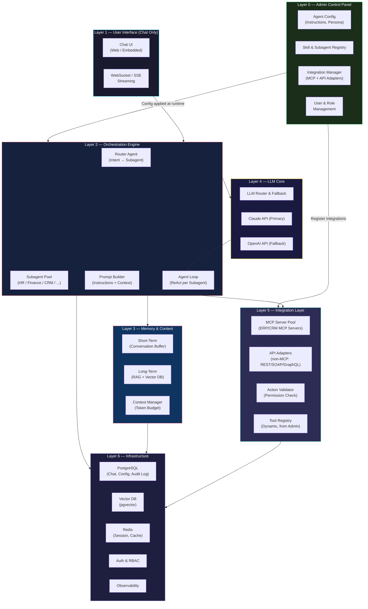
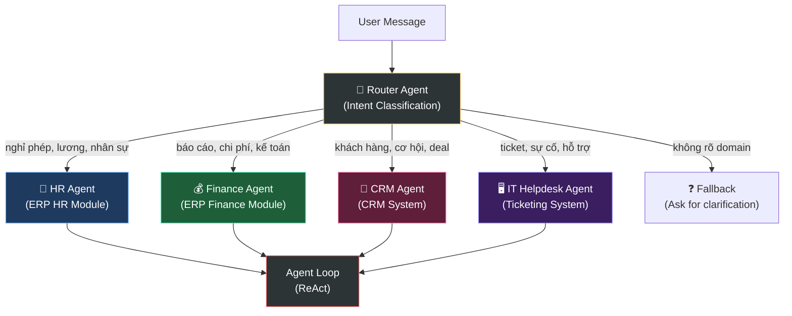
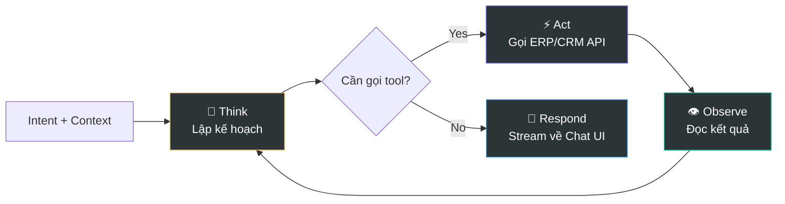
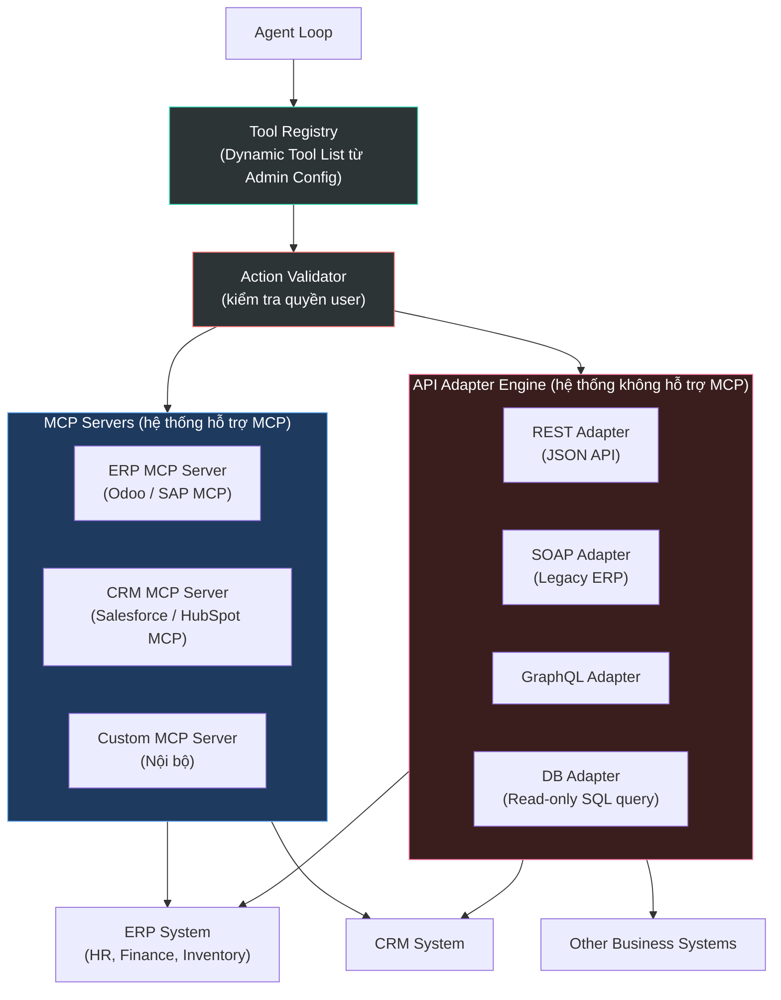
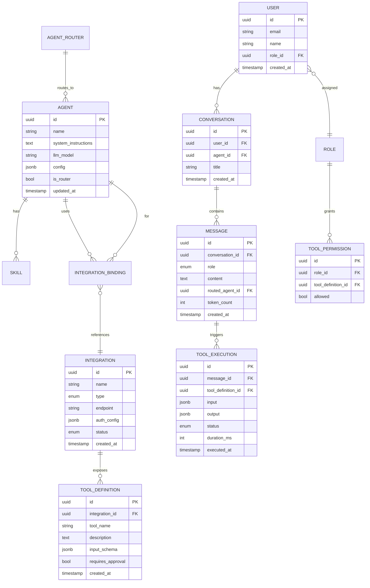
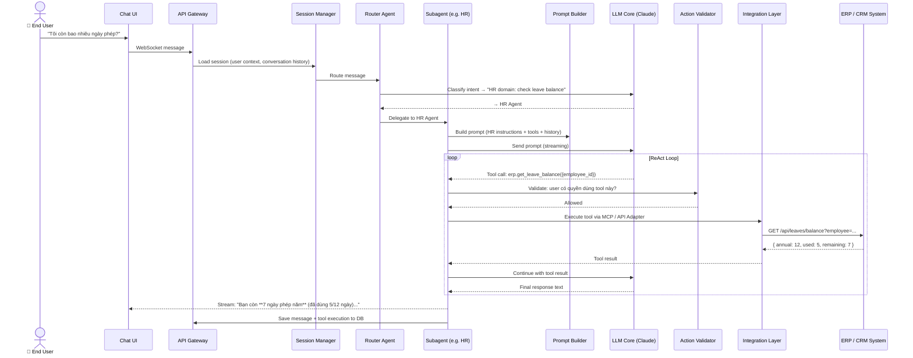
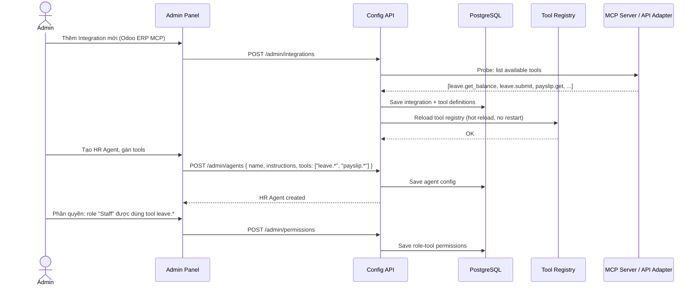
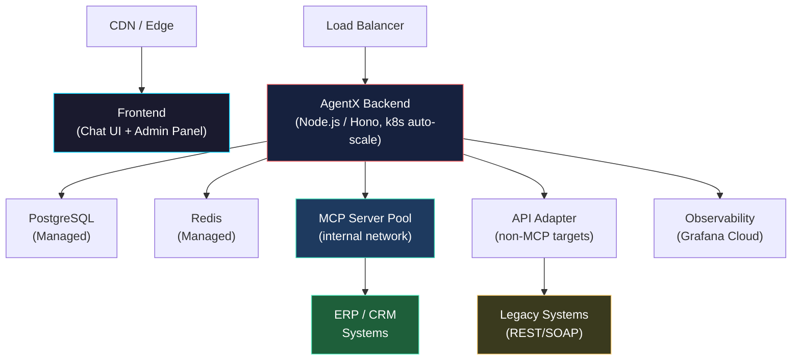

# AgentX — System Architecture Overview

> **Mục tiêu**: Xây dựng một AI Agent platform tích hợp với các hệ thống doanh nghiệp (ERP, CRM, HRM, ...) thông qua giao diện **chat đơn giản**. Người dùng cuối chỉ cần nhắn tin — agent sẽ tự động hiểu intent, định tuyến tới đúng sub-agent, gọi đúng hệ thống nghiệp vụ và trả kết quả. Toàn bộ cấu hình agent (instructions, skills, subagents, integrations) được quản lý bởi **Admin**.

---

## Table of Contents

- [1. High-Level Architecture](#1-high-level-architecture)
- [2. Layer Overview](#2-layer-overview)
  - [Layer 0 — Admin Control Panel](#layer-0--admin-control-panel)
  - [Layer 1 — User Interface (Chat)](#layer-1--user-interface-chat)
  - [Layer 2 — Orchestration Engine](#layer-2--orchestration-engine)
  - [Layer 3 — Memory & Context](#layer-3--memory--context)
  - [Layer 4 — LLM Core](#layer-4--llm-core)
  - [Layer 5 — Integration Layer](#layer-5--integration-layer)
  - [Layer 6 — Infrastructure](#layer-6--infrastructure)
- [3. Data Flow](#3-data-flow)
- [4. Tech Stack](#4-tech-stack)
- [5. Deployment Architecture](#5-deployment-architecture)
- [6. Detailed Documentation](#6-detailed-documentation)

---

## 1. High-Level Architecture

<!-- Kiến trúc tổng thể: Admin cấu hình agent/skill/integration → User chỉ cần chat -->



---

## 2. Layer Overview

---

### Layer 0 — Admin Control Panel

<!-- Nơi Admin cấu hình toàn bộ hệ thống — người dùng cuối không thấy layer này -->

> **Đây là layer quan trọng nhất về mặt vận hành.** Admin (System Admin hoặc IT Manager) quản lý toàn bộ hành vi của các agent mà không cần thay đổi code.

| Component | Description |
|-----------|-------------|
| **Agent Configuration** | Định nghĩa các agent: system instructions, persona, tone, phạm vi nhiệm vụ, model LLM sử dụng |
| **Skill & Subagent Registry** | Tạo và quản lý các subagent domain-specific (HR Agent, Finance Agent, CRM Agent...), gán skill cho từng agent |
| **Integration Manager** | Đăng ký MCP Servers (nếu hệ thống hỗ trợ MCP) hoặc cấu hình API Adapters (URL, auth, mapping) cho hệ thống không hỗ trợ MCP |
| **Routing Rules** | Định nghĩa quy tắc định tuyến intent → subagent (keyword-based hoặc LLM-classified) |
| **User & Role Management** | Phân quyền người dùng: user nào được chat với agent nào, được thực thi action nào |
| **Audit & Monitoring** | Xem lịch sử action đã thực thi, chi phí LLM, các lỗi integration |

**Admin Configuration Model:**
```
Agent Definition
├── name: "HR Assistant"
├── instructions: "Bạn là trợ lý nhân sự của Twendee..."
├── llm_model: "claude-sonnet-4"
├── allowed_tools: ["erp_leave_request", "erp_payslip", "hrm_org_chart"]
├── subagents: []  # leaf agent, không có subagent
└── routing_keywords: ["nghỉ phép", "lương", "phòng ban", "nhân sự"]

Agent Definition
├── name: "Router Agent"
├── instructions: "Phân tích intent và chuyển tới đúng agent chuyên môn"
├── subagents: ["HR Assistant", "Finance Agent", "CRM Agent", "IT Helpdesk"]
└── fallback_response: "Tôi chưa được cấu hình để xử lý yêu cầu này."
```

> 📄 **Detail**: [00-admin-control-panel.md](./00-admin-control-panel.md) *(to be created)*

---

### Layer 1 — User Interface (Chat)

<!-- Giao diện duy nhất cho người dùng cuối: chỉ cần chat, không cần cấu hình gì -->

> **User không cần biết gì về agent, tool, hay integration.** Họ chỉ nhắn tin bằng ngôn ngữ tự nhiên.

| Component | Description | Technology |
|-----------|-------------|------------|
| **Chat UI** | Giao diện chat đơn giản — hỗ trợ streaming response, hiển thị trạng thái tool đang chạy, lịch sử hội thoại | Next.js + Vercel AI SDK |
| **Embedded Widget** | Nhúng được vào hệ thống nội bộ (ERP, Portal) dưới dạng iframe hoặc web component | Web Component / iframe |
| **WebSocket / SSE** | Stream token từng phần từ server → UI, hiển thị typing indicator | SSE (Server-Sent Events) |

**UX Principles cho End User:**
- Không có button "chọn agent" — routing tự động hoàn toàn
- Hiển thị subtle indicator khi agent đang gọi hệ thống ngoài (vd: `🔄 Đang tra cứu phiếu lương...`)
- Kết quả trả về dạng Markdown có cấu trúc (bảng, danh sách)
- Lịch sử chat được giữ lại theo session hoặc user

> 📄 **Detail**: [01-user-interface.md](./01-user-interface.md) *(to be created)*

---

### Layer 2 — Orchestration Engine

<!-- Trái tim của hệ thống: nhận message → phân tích intent → chọn subagent → chạy agent loop -->

> **Multi-agent architecture**: Một Router Agent đứng đầu, phân tích intent và điều phối tới các Subagent chuyên biệt theo domain nghiệp vụ.

#### 2.1 Router Agent



#### 2.2 Agent Loop (ReAct per Subagent)

Mỗi Subagent chạy vòng lặp ReAct độc lập:



#### 2.3 Prompt Builder

Mỗi lần gọi LLM, Prompt Builder ghép:
```
[System Instructions từ Admin Config]
+ [Subagent Persona & Scope]
+ [Available Tools (từ Tool Registry)]
+ [User Role & Permissions]
+ [Conversation History (trong token budget)]
+ [RAG Context nếu có]
+ [User Message hiện tại]
```

> 📄 **Detail**: [02-orchestration-engine.md](./02-orchestration-engine.md) *(to be created)*

---

### Layer 3 — Memory & Context

<!-- Bộ nhớ của agent: ngắn hạn (hội thoại), dài hạn (kiến thức), kiểm soát token -->

| Memory Type | Mục đích | Storage |
|-------------|---------|---------|
| **Short-Term** | Buffer hội thoại hiện tại của user — tối đa N turns gần nhất | Redis (in-memory) |
| **Long-Term** | Knowledge base doanh nghiệp: tài liệu quy trình, FAQ, chính sách | Vector DB (pgvector) |
| **Context Manager** | Kiểm soát token budget — quyết định giữ lại / tóm tắt / loại bỏ gì trước khi gửi LLM | Computed |

**Lưu ý**: Không cần "Project Knowledge Base" phức tạp như Claude Projects. Knowledge base là toàn cục theo domain, do Admin upload và index sẵn.

> 📄 **Detail**: [03-memory-context.md](./03-memory-context.md) *(to be created)*

---

### Layer 4 — LLM Core

<!-- Kết nối LLM: routing model, streaming, fallback -->

| Component | Description |
|-----------|-------------|
| **LLM Router** | Mỗi Agent có thể dùng model khác nhau (cấu hình bởi Admin) — Agent đơn giản dùng Haiku, Agent phức tạp dùng Sonnet |
| **Claude API** | Primary — tool use, streaming, 200K context |
| **OpenAI API** | Fallback khi Claude không available hoặc rate limit |
| **Streaming Handler** | Parse SSE chunks, detect tool call events, route về Response Router |

> 📄 **Detail**: [04-llm-core.md](./04-llm-core.md) *(to be created)*

---

### Layer 5 — Integration Layer

<!-- Tầng tích hợp quan trọng nhất: kết nối agent với ERP/CRM/HRM thực tế -->

> **Đây là layer đặc trưng nhất của AgentX** so với AI agent thông thường. Hệ thống doanh nghiệp đa dạng — có hệ thống hỗ trợ MCP, có hệ thống chỉ có REST API, thậm chí SOAP. Layer này chuẩn hóa tất cả thành **Tool interface thống nhất** mà Agent Loop có thể gọi.



#### 5.1 MCP Integration

Với hệ thống hỗ trợ **Model Context Protocol (MCP)**:

```
Admin đăng ký MCP Server:
├── name: "Odoo ERP"
├── transport: "stdio" | "sse" | "http"
├── endpoint: "http://erp-mcp-server:3000/sse"
├── auth: { type: "api_key", key: "***" }
└── allowed_agents: ["HR Agent", "Finance Agent"]

→ Tool Registry tự động import tool list từ MCP Server
→ Agent có thể gọi tool như: erp.get_leave_balance, erp.submit_leave_request
```

#### 5.2 API Adapter (non-MCP)

Với hệ thống **chỉ có REST/SOAP API**:

```
Admin cấu hình API Adapter:
├── name: "Legacy HRM System"
├── base_url: "https://hrm.internal/api/v1"
├── auth: { type: "bearer", token_env: "HRM_API_TOKEN" }
├── tools:
│   ├── get_employee_info:
│   │   ├── method: GET
│   │   ├── path: "/employees/{employee_id}"
│   │   └── description: "Lấy thông tin nhân viên theo ID"
│   └── submit_leave_request:
│       ├── method: POST
│       ├── path: "/leave-requests"
│       └── body_mapping: { ... }
└── allowed_agents: ["HR Agent"]

→ Tool Registry tạo Tool Definition tương đương MCP
→ Agent gọi tool: hrm.get_employee_info, hrm.submit_leave_request
```

#### 5.3 Action Validator

> **Mọi action đều phải qua validation trước khi thực thi** — đây là cơ chế bảo vệ quan trọng nhất.

```
Validation Pipeline:
1. Authentication  → User đã đăng nhập chưa?
2. Authorization   → User có quyền dùng tool này không? (RBAC từ Admin config)
3. Rate Limiting   → User có vượt giới hạn gọi API không?
4. Input Sanitize  → Params có hợp lệ theo schema không?
5. Approval Gate   → Tool này có cần human-approval trước khi chạy không?
                     (VD: xóa dữ liệu, gửi email hàng loạt)
```

> 📄 **Detail**: [05-integration-layer.md](./05-integration-layer.md) *(to be created)*

---

### Layer 6 — Infrastructure

<!-- Nền tảng lưu trữ, vận hành: DB, cache, storage, auth, monitoring -->

| Component | Purpose | Technology |
|-----------|---------|------------|
| **PostgreSQL** | Chat history, agent/skill config, user data, audit log mọi action | PostgreSQL 16+ |
| **Vector DB** | Lưu embeddings cho RAG — knowledge base doanh nghiệp (quy trình, FAQ...) | pgvector (extension của PG) |
| **Redis** | Session cache, rate limiting, pub/sub cho streaming events | Redis 7+ |
| **Auth & RBAC** | Xác thực user, phân quyền Admin vs End User, quản lý API keys | Clerk hoặc Supabase Auth |
| **Config Store** | Lưu Agent configs, Tool Registry, Integration settings (versioned) | PostgreSQL + Redis cache |
| **Observability** | Structured logs, LLM cost tracking, integration error monitoring | OpenTelemetry + Grafana |

**Database Schema Overview:**



> 📄 **Detail**: [06-infrastructure.md](./06-infrastructure.md) *(to be created)*

---

## 3. Data Flow

### 3.1 End-to-End Message Flow (User → Agent → ERP/CRM → User)

<!-- Luồng hoàn chỉnh: từ user nhắn tin đến nhận kết quả từ hệ thống nghiệp vụ -->



### 3.2 Admin Config Flow (cấu hình Agent/Integration)



---

## 4. Tech Stack

<!-- Stack công nghệ đề xuất để build AgentX -->

| Layer | Technology | Lý do chọn |
|-------|-----------|------------|
| **Frontend (Chat UI)** | Next.js 15 + Vercel AI SDK | Streaming out-of-box, dễ embed, React ecosystem |
| **Admin Panel** | Next.js 15 (same codebase, admin routes) | Tái sử dụng components, single deployment |
| **Backend** | Node.js (Hono / NestJS / Express) + TS | Phù hợp nhất để chạy các bộ thư viện AI SDK thế hệ mới và duy trì kết nối real-time |
| **Agent Orchestration** | Vercel AI SDK Core & UI | Đơn giản hóa việc quản lý vòng lặp ReAct, hỗ trợ streaming UI và quản lý MCP native |
| **LLM Primary** | Anthropic Claude API (Sonnet / Haiku) | Tool use tốt nhất, streaming, large context |
| **LLM Fallback** | OpenAI GPT-4o | Độ available cao |
| **MCP Integration** | `@ai-sdk/mcp` (SSE / HTTP / stdio) | Thư viện chuẩn kết nối MCP Client trong hệ sinh thái Node.js |
| **API Adapter** | Custom adapter engine (Node.js + Fetch/Axios) | Chuyển đổi REST/SOAP API thành MCP Tool |
| **Database** | PostgreSQL 16 + pgvector | Một DB cho cả relational + vector, đơn giản vận hành |
| **Cache / Session** | Redis 7 | Session agent loop, rate limit, hot config cache |
| **Auth** | Clerk hoặc Supabase Auth | RBAC, JWT, dễ tích hợp |
| **Observability** | OpenTelemetry + Grafana + Loki | LLM cost tracking, integration error monitoring |
| **Deployment** | Docker Compose (dev) → Kubernetes (prod) | Progressive scale |

---

## 5. Deployment Architecture

### 5.1 Development (Local)

```
docker-compose.yml
├── agentx-backend      (Node.js / Hono, port 8000)
├── agentx-frontend     (Next.js: Chat UI + Admin Panel, port 3000)
├── postgres            (port 5432, with pgvector extension)
├── redis               (port 6379)
├── mcp-odoo            (Odoo MCP Server, port 3001) ← example
└── mcp-custom          (Custom internal MCP Server, port 3002)
```

### 5.2 Production



---

## 6. Detailed Documentation

<!-- File chi tiết từng layer — bổ sung dần -->

| # | Document | Status | Nội dung |
|---|----------|--------|---------|
| 0 | [00-admin-control-panel.md](./00-admin-control-panel.md) | 🔲 Planned | UI/UX Admin Panel, Agent builder, Integration manager, RBAC config |
| 1 | [01-user-interface.md](./01-user-interface.md) | 🔲 Planned | Chat UI design, streaming implementation, embedded widget |
| 2 | [02-orchestration-engine.md](./02-orchestration-engine.md) | 🔲 Planned | Router Agent design, Subagent pool, ReAct loop implementation, Prompt Builder |
| 3 | [03-memory-context.md](./03-memory-context.md) | 🔲 Planned | Conversation memory, RAG pipeline, token budget algorithm |
| 4 | [04-llm-core.md](./04-llm-core.md) | 🔲 Planned | LLM provider abstraction, streaming protocol, model routing, fallback |
| 5 | [05-integration-layer.md](./05-integration-layer.md) | 🔲 Planned | MCP integration, API Adapter engine, Action Validator, Tool Registry |
| 6 | [06-infrastructure.md](./06-infrastructure.md) | 🔲 Planned | DB schema (full), migration, caching patterns, deployment configs |
| 7 | [07-security.md](./07-security.md) | 🔲 Planned | Auth flows, RBAC, API security, action audit trail, data isolation |
| 8 | [08-api-reference.md](./08-api-reference.md) | 🔲 Planned | REST API endpoints, WebSocket events, Admin API, Integration API |

---

## Appendix

### A. Glossary

| Term | Definition |
|------|-----------|
| **Router Agent** | Agent đứng đầu, phân tích intent người dùng và điều phối tới Subagent phù hợp |
| **Subagent** | Agent chuyên biệt cho một domain nghiệp vụ (HR, Finance, CRM...) |
| **Skill** | Một capability cụ thể được gán cho agent (vd: "check leave balance", "generate report") |
| **MCP** | Model Context Protocol — chuẩn kết nối LLM với external tools/data sources |
| **API Adapter** | Wrapper chuyển đổi REST/SOAP API thành Tool interface chuẩn mà Agent có thể gọi |
| **Action Validator** | Middleware kiểm tra quyền và an toàn trước khi thực thi bất kỳ action nào |
| **ReAct** | Reasoning + Acting — vòng lặp: suy nghĩ → gọi tool → quan sát kết quả → lặp |
| **RAG** | Retrieval-Augmented Generation — bổ sung context từ knowledge base vào prompt |
| **Tool Registry** | Danh sách dynamic các tool available, load từ MCP servers + API adapters |
| **Token Budget** | Giới hạn token phân bổ cho từng phần của context window |

### B. Key Design Decisions

> **Tại sao không dùng LangChain/LlamaIndex?**  
> Giữ orchestration tự viết để có full control — debug dễ hơn, không phụ thuộc version updates của framework bên ngoài. Chỉ dùng LangGraph nếu workflow trở nên quá phức tạp (parallel subagents, complex state machines).

> **Tại sao MCP + API Adapter song song?**  
> Thực tế doanh nghiệp: ít hệ thống hỗ trợ MCP native. API Adapter engine cho phép Admin tích hợp bất kỳ hệ thống nào chỉ bằng config (không cần code), trong khi MCP được ưu tiên khi hệ thống hỗ trợ.

> **Tại sao pgvector thay vì Pinecone?**  
> Đơn giản hóa vận hành — một PostgreSQL database cho cả relational data và vector search. Phù hợp scale vừa và nhỏ. Có thể migrate sang Pinecone nếu cần scale lớn hơn.

### C. References

- [Anthropic Claude API — Tool Use](https://docs.anthropic.com/en/docs/build-with-claude/tool-use)
- [Model Context Protocol (MCP)](https://modelcontextprotocol.io/)
- [ReAct: Synergizing Reasoning and Acting in LLMs](https://arxiv.org/abs/2210.03629)
- [Vercel AI SDK — Streaming](https://sdk.vercel.ai/docs/ai-sdk-ui/streaming)
- [pgvector — Vector Search in PostgreSQL](https://github.com/pgvector/pgvector)

---

*Last updated: 2026-06-05*  
*Version: 0.2.0 — Revised for ERP/CRM integration use case*
