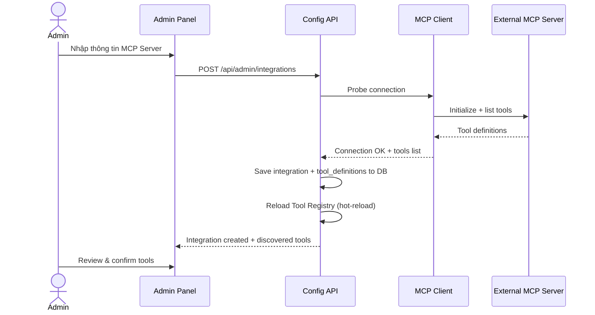
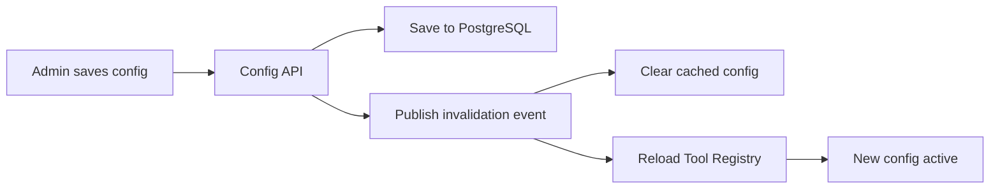

# Layer 0 — Admin Control Panel

> **Mục tiêu**: Hướng dẫn chi tiết thiết kế và triển khai Bảng điều khiển quản trị (Admin Control Panel) — nơi Admin cấu hình toàn bộ hành vi hệ thống AgentX mà không cần thay đổi code.

---

## 1. Tổng quan

Admin Control Panel là tầng quản trị dành riêng cho **System Admin / IT Manager**. End User không thấy và không truy cập được layer này. Mọi thay đổi cấu hình được áp dụng **hot-reload** tại runtime mà không cần restart server.

### Chức năng chính

| Module | Mô tả | Route |
|--------|-------|-------|
| **Dashboard** | Tổng quan hệ thống: active agents, active integrations, LLM cost 24h, error rate | `/admin` |
| **Agent Builder** | Tạo/sửa/xóa agents, gán tools, cấu hình routing | `/admin/agents` |
| **Integration Manager** | Đăng ký MCP Server, test connection, khám phá tools | `/admin/integrations` |
| **User & Role Management** | CRUD users, phân quyền RBAC | `/admin/users` |
| **Audit Logs** | Xem lịch sử tool execution, LLM cost, error logs | `/admin/audit` |

---

## 2. Agent Builder

### 2.1 Agent Configuration Model

Mỗi Agent được định nghĩa bởi các trường sau:

```typescript
interface AgentDefinition {
  id: string;                    // UUID auto-generated
  name: string;                  // Tên agent: "HR Assistant", "Finance Agent"
  systemInstructions: string;    // System prompt định nghĩa persona và quy tắc
  llmProvider?: string;          // Override provider (null = dùng mặc định theo tier)
  llmModel?: string;             // Override model (null = dùng mặc định theo tier)
  tier: 'fast' | 'smart' | 'vision';  // LLM tier mặc định
  isRouter: boolean;             // true = Router Agent, false = Specialist Agent
  maxSteps: number;              // Giới hạn ReAct loop (mặc định: 10)
  allowedTools: string[];        // Danh sách tool names được phép dùng
  routingKeywords: string[];     // Keywords cho rule-based routing
  config: Record<string, any>;   // Cấu hình mở rộng (JSONB)
  isActive: boolean;             // Bật/tắt agent
  createdAt: Date;
  updatedAt: Date;
}
```

### 2.2 Agent Builder UI Specifications

#### Form tạo/sửa Agent

```
┌─────────────────────────────────────────────────────────────┐
│ Agent Builder                                    [Save] [Cancel] │
├─────────────────────────────────────────────────────────────┤
│                                                               │
│ Agent Name: [_________________________]                       │
│                                                               │
│ Type:  ○ Router Agent    ● Specialist Agent                   │
│                                                               │
│ System Instructions:                                          │
│ ┌───────────────────────────────────────────────────────────┐ │
│ │ Bạn là trợ lý nhân sự của công ty...                      │ │
│ │ (Markdown editor with preview)                             │ │
│ └───────────────────────────────────────────────────────────┘ │
│                                                               │
│ LLM Configuration:                                            │
│   Tier: [Smart ▼]                                             │
│   Override Provider: [-- Default -- ▼]                        │
│   Override Model:    [________________]                       │
│                                                               │
│ Max Steps: [10]                                               │
│                                                               │
│ Routing Keywords: [nghỉ phép] [lương] [nhân sự] [+ Add]      │
│                                                               │
│ Assigned Tools:                                               │
│   ☑ erp.get_leave_balance                                     │
│   ☑ erp.submit_leave_request                                  │
│   ☑ erp.get_payslip                                           │
│   ☐ crm.get_customer (not assigned)                           │
│   [Select Tools...]                                           │
│                                                               │
│ Status: [Active ▼]                                            │
└─────────────────────────────────────────────────────────────┘
```

#### Validation Rules

| Field | Rule |
|-------|------|
| `name` | Required, 3-100 chars, unique |
| `systemInstructions` | Required, max 10,000 chars |
| `tier` | Required, enum: `fast`, `smart`, `vision` |
| `maxSteps` | Required, integer 1-20 |
| `allowedTools` | At least 1 tool if Specialist Agent |
| `routingKeywords` | Required if Specialist Agent (để Router phân loại) |

### 2.3 Router Agent Configuration

Router Agent có cấu hình đặc biệt:
- `isRouter: true`
- `allowedTools: []` — Router không gọi tool trực tiếp
- Thêm field `subagentIds: string[]` — danh sách Agent IDs mà Router có thể điều phối tới
- `fallbackResponse: string` — Câu trả lời khi không match intent nào

```typescript
interface RouterAgentConfig {
  subagentIds: string[];         // UUIDs of specialist agents
  routingStrategy: 'keyword' | 'llm' | 'hybrid';
  fallbackResponse: string;
}
```

---

## 3. Integration Manager

### 3.1 Integration Registration Flow



### 3.2 Integration Configuration Schema

```typescript
interface IntegrationConfig {
  id: string;
  name: string;                     // "Odoo ERP", "Salesforce CRM"
  description?: string;
  transport: 'sse' | 'stdio';      // Loại kết nối

  // SSE Transport
  endpoint?: string;                // URL: "https://erp.internal/mcp/sse"
  headers?: Record<string, string>; // Custom headers (Auth, etc.)

  // stdio Transport
  command?: string;                 // "npx"
  args?: string[];                  // ["-y", "@modelcontextprotocol/server-postgres", "..."]
  env?: Record<string, string>;     // Environment variables cho process

  // Auth configuration cho User-scoped auth
  authConfig?: {
    type: 'none' | 'bearer' | 'oauth2';
    oauthAuthorizationUrl?: string;
    oauthTokenUrl?: string;
    oauthScopes?: string[];
  };

  status: 'active' | 'inactive' | 'error';
  lastHealthCheck?: Date;
  createdAt: Date;
  updatedAt: Date;
}
```

### 3.3 Connection Testing

Admin có thể test connection trước khi lưu:

```typescript
// POST /api/admin/integrations/test-connection
interface TestConnectionRequest {
  transport: 'sse' | 'stdio';
  endpoint?: string;
  headers?: Record<string, string>;
  command?: string;
  args?: string[];
}

interface TestConnectionResponse {
  success: boolean;
  latencyMs: number;
  discoveredTools: {
    name: string;
    description: string;
    inputSchema: object;
  }[];
  error?: string;
}
```

---

## 4. User & Role Management

### 4.1 RBAC Model

AgentX sử dụng mô hình RBAC đơn giản với 2 role mặc định:

| Role | Quyền hạn |
|------|-----------|
| **ADMIN** | Toàn quyền: quản lý agents, integrations, users, xem audit logs, chat |
| **STAFF** | Chỉ được chat với agents được phân quyền, không truy cập admin panel |

### 4.2 Tool Permission Matrix

Admin gán quyền sử dụng tool theo Role:

```typescript
interface ToolPermission {
  id: string;
  roleId: string;           // FK → roles
  toolPattern: string;      // Wildcard pattern: "erp.*", "crm.get_*", "db.query"
  allowed: boolean;
}
```

**Matching rules**:
- `erp.*` → match tất cả tool bắt đầu bằng `erp.`
- `crm.get_*` → match `crm.get_customer`, `crm.get_deals`, etc.
- `db.query` → match chính xác `db.query`

### 4.3 User Management API

```
GET    /api/admin/users              → List users (paginated)
POST   /api/admin/users              → Create user
PATCH  /api/admin/users/:id          → Update user
DELETE /api/admin/users/:id          → Soft delete user
GET    /api/admin/roles              → List roles
POST   /api/admin/roles/:id/permissions → Set tool permissions for role
```

---

## 5. Routing Rules Configuration

### 5.1 Routing Strategies

| Strategy | Mô tả | Ưu điểm | Nhược điểm |
|----------|--------|---------|------------|
| **keyword** | Match từ khóa trong `routingKeywords` của agent | Nhanh, chi phí 0 | Thiếu linh hoạt, cần maintain keywords |
| **llm** | Gọi LLM tier `fast` để classify intent | Chính xác cao, hiểu ngữ cảnh | Tốn thêm 1 lượt LLM call |
| **hybrid** | Thử keyword trước, nếu không match → fallback sang LLM | Tối ưu cả tốc độ và độ chính xác | Phức tạp hơn |

### 5.2 Routing Implementation

```typescript
class RouterService {
  async routeMessage(
    message: string,
    history: CoreMessage[],
    routerConfig: RouterAgentConfig,
    subagents: AgentDefinition[]
  ): Promise<string> {  // Returns target agent ID

    const strategy = routerConfig.routingStrategy;

    // 1. Keyword matching (nếu strategy là keyword hoặc hybrid)
    if (strategy === 'keyword' || strategy === 'hybrid') {
      for (const agent of subagents) {
        const matched = agent.routingKeywords.some(kw =>
          message.toLowerCase().includes(kw.toLowerCase())
        );
        if (matched) return agent.id;
      }
      if (strategy === 'keyword') {
        return null; // fallback response
      }
    }

    // 2. LLM-based classification (nếu strategy là llm hoặc hybrid fallback)
    const agentList = subagents.map(a => ({
      id: a.id,
      name: a.name,
      description: a.systemInstructions.substring(0, 200),
      keywords: a.routingKeywords
    }));

    const classificationPrompt = `
Bạn là bộ phân loại ý định (intent classifier).
Dựa trên tin nhắn của người dùng, hãy chọn agent phù hợp nhất.

Danh sách agents:
${JSON.stringify(agentList, null, 2)}

Tin nhắn: "${message}"

Trả về JSON: { "agentId": "<uuid>" }
Nếu không rõ ý định, trả về: { "agentId": null }`;

    const result = await this.llmService.generate({
      tier: 'fast',
      systemPrompt: 'You are an intent classifier. Respond in JSON only.',
      userPrompt: classificationPrompt,
    });

    const parsed = JSON.parse(result.text);
    return parsed.agentId;
  }
}
```

---

## 6. Audit Dashboard

### 6.1 Audit Log Schema

Mọi tool execution đều được ghi log:

```typescript
interface AuditLogEntry {
  id: string;
  userId: string;
  agentId: string;
  conversationId: string;
  messageId: string;
  toolName: string;
  toolInput: object;           // Sanitized (masked sensitive data)
  toolOutput: object;          // Sanitized
  status: 'success' | 'error' | 'denied' | 'approval_pending';
  errorMessage?: string;
  durationMs: number;
  executedAt: Date;
}
```

### 6.2 LLM Cost Summary

Dashboard hiển thị:
- **Total cost (24h / 7d / 30d)** theo USD
- **Cost breakdown** theo agent, model, tier
- **Token usage** trend chart
- **Top expensive conversations**

### 6.3 Dashboard Widgets

```
┌─────────────────────────────────────────────────────────────┐
│ Admin Dashboard                                              │
├──────────────┬──────────────┬──────────────┬────────────────┤
│ Active Agents│ Integrations │ LLM Cost 24h │ Error Rate     │
│     5        │     3 / 3 ✅ │   $12.45     │   0.2%         │
├──────────────┴──────────────┴──────────────┴────────────────┤
│                                                              │
│ [LLM Cost Trend Chart - 7 days]                              │
│                                                              │
├──────────────────────────────┬───────────────────────────────┤
│ Recent Tool Executions       │ Top Agents by Usage            │
│ ─────────────────────────── │ ───────────────────────────── │
│ ✅ erp.get_leave  2ms ago   │ HR Assistant      45%          │
│ ✅ crm.get_deals  5ms ago   │ Finance Agent     30%          │
│ ❌ db.query       8ms ago   │ CRM Agent         25%          │
└──────────────────────────────┴───────────────────────────────┘
```

---

## 7. Admin API Endpoints

### 7.1 Agents API

```
GET    /api/admin/agents                → List all agents
POST   /api/admin/agents                → Create agent
GET    /api/admin/agents/:id            → Get agent detail
PATCH  /api/admin/agents/:id            → Update agent
DELETE /api/admin/agents/:id            → Delete agent (soft)
POST   /api/admin/agents/:id/tools      → Assign tools to agent
GET    /api/admin/agents/:id/stats      → Get agent usage stats
```

### 7.2 Integrations API

```
GET    /api/admin/integrations              → List integrations
POST   /api/admin/integrations              → Register new integration
GET    /api/admin/integrations/:id          → Get integration detail
PATCH  /api/admin/integrations/:id          → Update integration
DELETE /api/admin/integrations/:id          → Remove integration
POST   /api/admin/integrations/test-connection → Test connection
GET    /api/admin/integrations/:id/tools    → List discovered tools
POST   /api/admin/integrations/:id/refresh  → Re-discover tools
```

### 7.3 Audit API

```
GET    /api/admin/audit/tool-executions     → List tool execution logs
GET    /api/admin/audit/llm-usage           → LLM cost & usage summary
GET    /api/admin/audit/errors              → Recent error logs
```

### 7.4 Authentication Guards

Tất cả routes `/api/admin/*` được bảo vệ bởi:

```typescript
@UseGuards(JwtAuthGuard, RolesGuard)
@Roles('ADMIN')
@Controller('admin')
export class AdminController {
  // ...
}
```

---

## 8. Hot-Reload Mechanism

Khi Admin thay đổi cấu hình (agents, integrations, permissions), hệ thống cần apply changes ngay lập tức:



**Implementation**:
1. Lưu config vào PostgreSQL (persistent)
2. Publish event qua Redis Pub/Sub: `config:invalidated:{type}`
3. Các service đang chạy subscribe event → reload config từ DB
4. Tool Registry re-initialize MCP connections nếu integration thay đổi

```typescript
// Redis Pub/Sub cho config hot-reload
class ConfigReloadService {
  async onConfigChange(type: 'agent' | 'integration' | 'permission') {
    // Publish invalidation event
    await this.redis.publish('config:invalidated', JSON.stringify({ type, timestamp: Date.now() }));
  }

  // Subscriber (chạy khi backend khởi động)
  async subscribeConfigChanges() {
    this.redis.subscribe('config:invalidated', async (message) => {
      const { type } = JSON.parse(message);
      switch (type) {
        case 'agent':
          await this.agentRegistry.reload();
          break;
        case 'integration':
          await this.integrationManager.reinitialize();
          break;
        case 'permission':
          await this.permissionCache.clear();
          break;
      }
    });
  }
}
```

---

*Last updated: 2026-06-06*
*Version: 0.1.0 — Initial Admin Control Panel spec*
