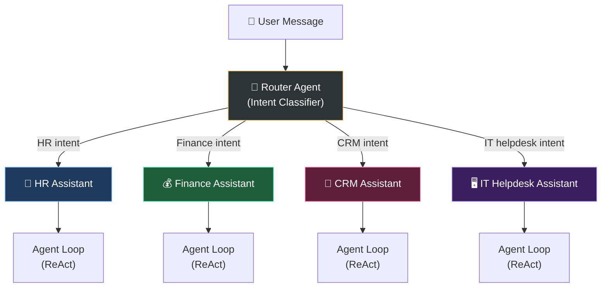

# Layer 2 — Orchestration Engine

> **Mục tiêu**: Hướng dẫn chi tiết thiết kế và triển khai Bộ máy điều phối (Orchestration Engine) đa tác tử (Multi-agent) của AgentX sử dụng Vercel AI SDK Core (`streamText` / `generateText`).

---

## 1. Multi-Agent Design Pattern

AgentX sử dụng mô hình **Router → Specialist Agents** (Bộ định tuyến và các tác tử chuyên biệt) để giải quyết các tác vụ nghiệp vụ phức tạp của doanh nghiệp. Môi hình này giúp cô lập phạm vi trách nhiệm (scope) của từng agent, giảm tải số lượng công cụ (tools) phải gửi cho LLM trong mỗi lượt chat, và tăng độ chính xác trong lập luận.



### 1.1 Router Agent
Router Agent là điểm chạm đầu tiên khi nhận được tin nhắn từ User. Nhiệm vụ của nó là phân tích ý định (Intent Classification) để lựa chọn Subagent phù hợp nhất dựa trên danh sách Agent được Admin cấu hình.

Có 2 cơ chế định tuyến được hỗ trợ:
1. **Rule-based Router**: Dựa trên các từ khóa (keywords) và cụm từ đặc trưng được Admin định nghĩa thủ công trong cấu hình của từng agent (nhanh, chi phí 0).
2. **LLM-based Router**: Gọi một mô hình LLM nhỏ, giá rẻ (như Claude Haiku) để phân loại mục đích câu hỏi của người dùng và gán nhãn Agent đích (độ chính xác cao, hiểu ngữ cảnh phức tạp).
3. **Default / Fallback Agent (Khi không rõ domain)**: Trong trường hợp ý định của người dùng không thuộc bất kỳ domain chuyên biệt nào (HR, Finance, CRM...) hoặc câu hỏi mơ hồ, Router Agent sẽ tự động định tuyến cuộc hội thoại đến **General / Fallback Agent** (Agent mặc định) để trả lời chung hoặc yêu cầu người dùng làm rõ câu hỏi.

### 1.2 Specialist (Sub) Agents
Các Agent chuyên trách được cấu hình riêng biệt về:
- **System Instructions**: Luật ứng xử, quy trình làm việc chuẩn (SOPs).
- **Tool Scope**: Danh sách các công cụ kết nối với các MCP Server / API cụ thể mà agent này được phép dùng.
- **Model Target**: Tùy chỉnh sử dụng mô hình LLM phù hợp (Ví dụ: HR Agent dùng Sonnet 3.5 để phân tích luật phép phức tạp, IT Helpdesk Agent dùng Haiku để giải quyết ticket nhanh).

---

## 2. ReAct Agent Loop Implementation with Vercel AI SDK

Vòng lặp ReAct (Reasoning and Acting) cho phép agent thực hiện chuỗi hành động: Suy nghĩ kế hoạch -> Gọi Tool nghiệp vụ -> Nhận kết quả và quan sát -> Suy nghĩ bước tiếp theo cho đến khi có kết quả cuối cùng.

AgentX sử dụng hàm `streamText` từ Vercel AI SDK Core để tự động quản lý vòng lặp ReAct này qua tham số `maxSteps` (Multi-step tool calling).

### Code Triển khai Agent Loop tại Backend (TypeScript)

```typescript
import { streamText, type CoreMessage } from 'ai';
import { getAgentConfig } from './db/agent-store';
import { IntegrationManager } from './integration-manager';
import { validateToolExecution } from './action-validator';
import { LlmService } from './llm/llm.service';

interface ChatSession {
  sessionId: string;
  userId: string;
  userRole: string;
  history: CoreMessage[];
}

export class Orchestrator {
  constructor(
    private integrationManager: IntegrationManager,
    private llmService: LlmService
  ) {}

  /**
   * Chạy luồng xử lý tin nhắn chính
   */
  async processMessage(
    session: ChatSession,
    userMessage: string,
    onTokenStream: (token: string) => void,
    onToolCall: (name: string, args: any) => void
  ) {
    // 1. Định tuyến để chọn Subagent phù hợp nhất
    const targetAgentId = await this.routeIntent(userMessage, session.history);
    const agentConfig = await getAgentConfig(targetAgentId);

    // 2. Phân giải Model động thông qua LlmService
    const agentContext = {
      agentType: agentConfig.name,
      definition: {
        llmProvider: agentConfig.llmProvider,
        llmModel: agentConfig.llmModel,
      },
    };
    const binding = await this.llmService.resolveModel(
      agentConfig.tier || 'smart', // Mặc định là 'smart' tier
      agentContext
    );

    // 3. Lấy danh sách tools tương ứng được gán cho Agent này
    // Bản thân các tools này liên kết tới các MCP Server tương ứng
    const allTools = this.integrationManager.getAllTools();
    const allowedTools: Record<string, any> = {};

    for (const toolName of agentConfig.allowedTools) {
      if (allTools[toolName]) {
        allowedTools[toolName] = {
          ...allTools[toolName],
          // Wrapper execute function để chèn middleware kiểm tra quyền (Action Validator)
          execute: async (args: any) => {
            // Kiểm tra quyền của User cụ thể trước khi thực thi tool
            await validateToolExecution(toolName, { userId: session.userId, role: session.userRole }, args);
            // Kích hoạt callback báo về UI trạng thái đang chạy tool
            onToolCall(toolName, args);
            // Thực thi thực tế qua MCP Client
            return allTools[toolName].execute(args);
          }
        };
      }
    }

    // 4. Thực thi ReAct loop qua streamText với Model đã phân giải động
    const result = streamText({
      model: binding.model, // model từ factory đã được nạp credentials
      system: `${agentConfig.systemInstructions}
      
               Bạn đang hỗ trợ người dùng có ID là ${session.userId} với vai trò ${session.userRole}. 
               Luôn tuân thủ tuyệt đối phân quyền của người dùng này.`,
      messages: [
        ...session.history,
        { role: 'user', content: userMessage }
      ],
      tools: allowedTools,
      maxSteps: agentConfig.maxSteps || 10, // Tối đa N bước suy nghĩ/gọi tool trong 1 request
    });

    // Stream kết quả về phía UI Client
    for await (const textPart of result.textStream) {
      onTokenStream(textPart);
    }

    // Lấy thông tin hội thoại đầy đủ sau khi hoàn tất ReAct loop để lưu trữ
    const finalMessages = await result.responseMessages;
    
    return {
      routedAgentId: targetAgentId,
      newMessages: [
        { role: 'user', content: userMessage },
        ...finalMessages
      ]
    };
  }

  /**
   * Định tuyến Intent sử dụng mô hình LLM nhỏ (Haiku)
   */
  private async routeIntent(message: string, history: CoreMessage[]): Promise<string> {
    // Trong thực tế, hàm này sẽ truy vấn DB lấy danh sách Agents khả dụng,
    // sau đó gửi prompt nhờ LLM phân loại và trả về Agent ID phù hợp.
    // Nếu tin nhắn khớp từ khóa có sẵn của agent nào, ta ưu tiên trả về luôn.
    
    // Placeholder logic:
    if (message.includes('nghỉ phép') || message.includes('lương')) {
      return 'agent-hr-uuid';
    }
    if (message.includes('khách hàng') || message.includes('cơ hội')) {
      return 'agent-crm-uuid';
    }
    return 'agent-general-uuid'; // Fallback agent
  }
}
```

---

## 3. Dynamic Prompt Construction

Mỗi lần gửi yêu cầu tới LLM, `Prompt Builder` sẽ xây dựng động system prompt dựa trên:

1. **System Prompt gốc của Agent** (do Admin định nghĩa).
2. **Quy trình làm việc nghiệp vụ (SOPs)** tương ứng được truy xuất từ Vector Store bằng RAG (RAG context).
3. **Định danh người dùng** (User Context): ID, Họ tên, Phòng ban, Vai trò nhằm giúp mô hình sinh câu trả lời cá nhân hóa và tự động điền các tham số khi gọi tool (ví dụ: tự động điền mã nhân viên khi xin nghỉ phép).
4. **Thời gian hiện tại**: Hệ thống luôn chèn thời gian hiện tại của máy chủ doanh nghiệp (Local server time) vào system prompt để agent tính toán thời gian nghỉ phép, kỳ lương chính xác.

### Cấu trúc Prompt gửi đi:

```
┌─────────────────────────────────────────────────────────────┐
│ SYSTEM PROMPT                                               │
│ - [Agent System Instructions từ DB]                         │
│ - Ngữ cảnh thời gian: "Hôm nay là Thứ Sáu, ngày 05/06/2026" │
│ - Ngữ cảnh người dùng: "User: Nguyễn Văn A (ID: 10292)"      │
│ - RAG Context: "Quy trình nghỉ phép của Twendee:..."         │
├─────────────────────────────────────────────────────────────┤
│ MESSAGES HISTORY                                            │
│ - User: Tôi muốn xin nghỉ phép vào ngày mai                  │
│ - Assistant: (Thinking: Cần gọi tool erp.create_leave)      │
│ - Tool Result: { success: true }                            │
│ - Assistant: Tôi đã gửi đơn nghỉ phép của bạn...            │
│ - User: Cảm ơn bạn!                                         │
├─────────────────────────────────────────────────────────────┤
│ USER MESSAGE                                                │
│ - User: Xem giúp tôi số ngày phép còn lại                   │
└─────────────────────────────────────────────────────────────┘
```

---

## 4. Error Handling & Loop Control

Nhằm đảm bảo AgentX không bị treo hoặc hoạt động sai lệch trong môi trường production, Orchestrator triển khai các cơ chế kiểm soát sau:

### 4.1 Ngăn chặn Vòng lặp Vô hạn (Infinite Loop Prevention)
Nếu Agent bị rơi vào trạng thái lặp đi lặp lại một hành động (Ví dụ: Gọi đi gọi lại 1 tool lỗi), hệ thống sẽ ngắt luồng:
- Cấu hình cứng `maxSteps: 10`.
- Khi chạm ngưỡng `maxSteps` mà chưa ra kết quả cuối cùng, hệ thống sẽ ngắt ReAct loop và trả về câu trả lời fallback thân thiện: *"Tôi đã cố gắng thực hiện tác vụ nhưng quá trình xử lý kéo dài hơn dự kiến. Xin hãy kiểm tra lại trạng thái trên hệ thống hoặc thử lại sau."*

### 4.2 Xử lý Lỗi Gọi Tool (Tool Failure Recovery)
Khi một công cụ ERP/CRM gặp lỗi (Lỗi kết nối mạng, Lỗi API ERP 500, Validate tham số sai):
- Không crash toàn bộ Agent Loop.
- Chuyển mã lỗi và thông điệp lỗi dạng text có cấu trúc ngược lại cho LLM (ví dụ: `{"error": "Không tìm thấy mã khách hàng KH-002", "code": 404}`).
- LLM sẽ đọc lỗi này như một phần **Observation** (Quan sát), từ đó tự động điều chỉnh hành vi (Ví dụ: hỏi lại user mã khách hàng đúng hoặc thông báo lỗi tường minh thay vì trả về lỗi kĩ thuật thô).

### 4.3 Quản lý Session Timeout
Bất kỳ phiên gọi ReAct loop nào vượt quá **30 giây** sẽ tự động bị ngắt kết nối (timeout) để bảo vệ tài nguyên máy chủ và tránh phát sinh chi phí LLM vô hạn do mô hình bị đơ.

---

*Last updated: 2026-06-05*  
*Version: 0.1.0 — Initial Orchestration spec*
