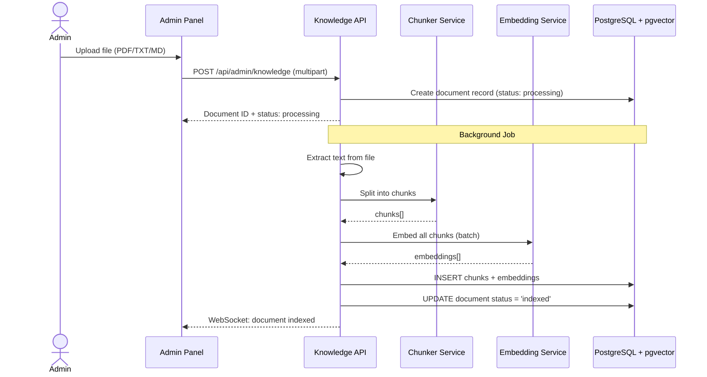

# Layer 3 — Memory & Context

> **Mục tiêu**: Hướng dẫn chi tiết thiết kế và triển khai Tầng Bộ nhớ & Ngữ cảnh (Memory & Context) của AgentX — quản lý bộ nhớ hội thoại ngắn hạn, kiến thức dài hạn (RAG), và kiểm soát token budget trước khi gửi prompt tới LLM.

---

## 1. Tổng quan

Layer 3 giải quyết 3 vấn đề cốt lõi:

| Vấn đề | Giải pháp | Storage |
|--------|-----------|---------|
| Agent cần nhớ những gì user vừa nói | **Short-Term Memory** — buffer N turns gần nhất | Redis |
| Agent cần kiến thức doanh nghiệp (quy trình, FAQ) | **Long-Term Memory** — RAG pipeline với Vector DB | PostgreSQL + pgvector |
| Context window có giới hạn token | **Context Manager** — token budget algorithm | Computed at runtime |

```mermaid
flowchart LR
    USER[User Message] --> CM[Context Manager]
    STM[Short-Term Memory<br/>(Redis)] --> CM
    LTM[Long-Term Memory<br/>(pgvector RAG)] --> CM
    CM --> PROMPT[Final Prompt<br/>(within token budget)]
    PROMPT --> LLM[LLM Core]
```

---

## 2. Short-Term Memory (Conversation Buffer)

### 2.1 Thiết kế

Mỗi conversation giữ lại **N turns gần nhất** (mặc định: 20 turns) trong Redis để đảm bảo tốc độ truy cập nhanh. Đồng thời, toàn bộ history được persist vào PostgreSQL cho mục đích lưu trữ lâu dài.

```typescript
// Key structure trong Redis
const KEY_PATTERN = `chat:session:{conversationId}:messages`;

interface ConversationBuffer {
  conversationId: string;
  messages: CoreMessage[];         // Vercel AI SDK CoreMessage format
  maxTurns: number;                // Mặc định: 20
  lastUpdated: number;             // Unix timestamp
}
```

### 2.2 Implementation

```typescript
// src/features/conversations/conversation-memory.service.ts
import { Injectable, Inject } from '@nestjs/common';
import { RedisService } from '../../redis/redis.service';
import type { CoreMessage } from 'ai';

@Injectable()
export class ConversationMemoryService {
  private readonly MAX_TURNS = 20;
  private readonly TTL_SECONDS = 86400; // 24h

  constructor(private readonly redis: RedisService) {}

  /**
   * Lấy lịch sử hội thoại từ Redis (fast path)
   * Fallback sang PostgreSQL nếu cache miss
   */
  async getHistory(conversationId: string): Promise<CoreMessage[]> {
    const key = `chat:session:${conversationId}:messages`;
    const cached = await this.redis.get(key);

    if (cached) {
      return JSON.parse(cached) as CoreMessage[];
    }

    // Cache miss → load từ DB và cache lại
    const dbMessages = await this.loadFromDatabase(conversationId);
    const recentMessages = dbMessages.slice(-this.MAX_TURNS);
    await this.redis.set(key, JSON.stringify(recentMessages), this.TTL_SECONDS);
    return recentMessages;
  }

  /**
   * Thêm messages mới vào buffer
   */
  async appendMessages(conversationId: string, newMessages: CoreMessage[]): Promise<void> {
    const key = `chat:session:${conversationId}:messages`;

    // 1. Lấy messages hiện tại
    const current = await this.getHistory(conversationId);

    // 2. Append và giữ lại MAX_TURNS gần nhất
    const updated = [...current, ...newMessages].slice(-this.MAX_TURNS);

    // 3. Update Redis cache
    await this.redis.set(key, JSON.stringify(updated), this.TTL_SECONDS);

    // 4. Persist vào PostgreSQL (async, không block)
    this.persistToDatabase(conversationId, newMessages).catch(err =>
      console.error('Failed to persist messages:', err)
    );
  }

  /**
   * Xóa cache khi conversation bị delete
   */
  async clearBuffer(conversationId: string): Promise<void> {
    await this.redis.del(`chat:session:${conversationId}:messages`);
  }

  private async loadFromDatabase(conversationId: string): Promise<CoreMessage[]> {
    // Query PostgreSQL: SELECT * FROM messages WHERE conversation_id = ? ORDER BY created_at ASC
    // Convert DB rows → CoreMessage format
    return [];
  }

  private async persistToDatabase(conversationId: string, messages: CoreMessage[]): Promise<void> {
    // INSERT INTO messages (conversation_id, role, content, ...) VALUES (...)
  }
}
```

### 2.3 Message Format (CoreMessage)

Tuân theo format của Vercel AI SDK:

```typescript
type CoreMessage =
  | { role: 'system'; content: string }
  | { role: 'user'; content: string }
  | { role: 'assistant'; content: string; tool_calls?: ToolCall[] }
  | { role: 'tool'; tool_call_id: string; content: string };
```

---

## 3. Long-Term Memory (RAG Pipeline)

### 3.1 Kiến trúc RAG

```mermaid
flowchart TD
    subgraph Indexing["Indexing Pipeline (Admin uploads)"]
        DOC[Upload Document<br/>(PDF, TXT, MD)] --> CHUNK[Text Chunker<br/>(500 tokens/chunk, 50 overlap)]
        CHUNK --> EMBED[Embedding Model<br/>(text-embedding-3-small)]
        EMBED --> STORE[Store to pgvector<br/>(vector + metadata)]
    end

    subgraph Retrieval["Retrieval Pipeline (Runtime)"]
        QUERY[User Query] --> Q_EMBED[Embed Query]
        Q_EMBED --> SEARCH[Vector Similarity Search<br/>(cosine, top-k=5)]
        SEARCH --> RERANK[Reranking<br/>(optional)]
        RERANK --> CONTEXT[Retrieved Context<br/>(injected into prompt)]
    end
```

### 3.2 Document Chunking

```typescript
// src/features/knowledge/chunker.service.ts

interface ChunkConfig {
  maxTokens: number;      // Kích thước mỗi chunk (mặc định: 500 tokens)
  overlapTokens: number;  // Overlap giữa chunks (mặc định: 50 tokens)
  separators: string[];   // Ưu tiên tách theo: '\n\n', '\n', '. ', ' '
}

const DEFAULT_CHUNK_CONFIG: ChunkConfig = {
  maxTokens: 500,
  overlapTokens: 50,
  separators: ['\n\n', '\n', '. ', ' '],
};

@Injectable()
export class ChunkerService {
  /**
   * Recursive character text splitter
   * Tách văn bản thành các chunks có kích thước đồng đều,
   * ưu tiên tách theo ranh giới tự nhiên (paragraph, sentence)
   */
  chunkText(text: string, config = DEFAULT_CHUNK_CONFIG): string[] {
    const chunks: string[] = [];
    // Implementation: recursive splitting by separators
    // Mỗi chunk có overlap với chunk trước để đảm bảo ngữ cảnh liên tục
    return chunks;
  }
}
```

### 3.3 Embedding & Storage

```typescript
// src/features/knowledge/embedding.service.ts
import { embed, embedMany } from 'ai';
import { openai } from '@ai-sdk/openai';

@Injectable()
export class EmbeddingService {
  private readonly embeddingModel = openai.embedding('text-embedding-3-small');

  /**
   * Embed một đoạn text
   */
  async embedText(text: string): Promise<number[]> {
    const { embedding } = await embed({
      model: this.embeddingModel,
      value: text,
    });
    return embedding;
  }

  /**
   * Embed nhiều chunks cùng lúc (batch)
   */
  async embedBatch(texts: string[]): Promise<number[][]> {
    const { embeddings } = await embedMany({
      model: this.embeddingModel,
      values: texts,
    });
    return embeddings;
  }
}
```

### 3.4 pgvector Schema

```sql
-- Bảng lưu trữ knowledge documents
CREATE TABLE knowledge_documents (
    id UUID PRIMARY KEY DEFAULT gen_random_uuid(),
    title VARCHAR(500) NOT NULL,
    source_type VARCHAR(50) NOT NULL,        -- 'pdf', 'txt', 'md', 'url'
    original_filename VARCHAR(500),
    total_chunks INTEGER DEFAULT 0,
    status VARCHAR(20) DEFAULT 'processing', -- 'processing', 'indexed', 'error'
    uploaded_by UUID REFERENCES users(id),
    created_at TIMESTAMP DEFAULT NOW(),
    updated_at TIMESTAMP DEFAULT NOW()
);

-- Bảng lưu trữ chunks + embeddings
CREATE TABLE knowledge_chunks (
    id UUID PRIMARY KEY DEFAULT gen_random_uuid(),
    document_id UUID NOT NULL REFERENCES knowledge_documents(id) ON DELETE CASCADE,
    chunk_index INTEGER NOT NULL,             -- Thứ tự chunk trong document
    content TEXT NOT NULL,                    -- Nội dung text của chunk
    embedding VECTOR(1536) NOT NULL,          -- Vector embedding (1536 dims cho text-embedding-3-small)
    token_count INTEGER,
    metadata JSONB DEFAULT '{}',              -- { "page": 5, "section": "Quy trình nghỉ phép" }
    created_at TIMESTAMP DEFAULT NOW()
);

-- Index cho vector similarity search
CREATE INDEX idx_chunks_embedding ON knowledge_chunks
    USING ivfflat (embedding vector_cosine_ops)
    WITH (lists = 100);

-- Index cho filter theo document
CREATE INDEX idx_chunks_document ON knowledge_chunks(document_id);
```

### 3.5 Retrieval Service

```typescript
// src/features/knowledge/retrieval.service.ts

@Injectable()
export class RetrievalService {
  constructor(
    @Inject(DRIZZLE_PROVIDER) private readonly db: NodePgDatabase<typeof schema>,
    private readonly embeddingService: EmbeddingService,
  ) {}

  /**
   * Tìm kiếm chunks liên quan nhất với query
   * @param query - Câu hỏi/tin nhắn của user
   * @param topK - Số lượng chunks trả về (mặc định: 5)
   * @returns Danh sách chunks có relevance cao nhất
   */
  async retrieve(query: string, topK = 5): Promise<RetrievedChunk[]> {
    // 1. Embed query
    const queryEmbedding = await this.embeddingService.embedText(query);

    // 2. Vector similarity search với pgvector
    const results = await this.db.execute(sql`
      SELECT
        kc.id,
        kc.content,
        kc.metadata,
        kd.title as document_title,
        1 - (kc.embedding <=> ${JSON.stringify(queryEmbedding)}::vector) as similarity
      FROM knowledge_chunks kc
      JOIN knowledge_documents kd ON kd.id = kc.document_id
      WHERE kd.status = 'indexed'
      ORDER BY kc.embedding <=> ${JSON.stringify(queryEmbedding)}::vector
      LIMIT ${topK}
    `);

    return results.rows.map(row => ({
      content: row.content,
      similarity: row.similarity,
      documentTitle: row.document_title,
      metadata: row.metadata,
    }));
  }
}

interface RetrievedChunk {
  content: string;
  similarity: number;          // 0-1, càng cao càng liên quan
  documentTitle: string;
  metadata: Record<string, any>;
}
```

---

## 4. Context Manager (Token Budget)

### 4.1 Token Budget Algorithm

Context window có giới hạn (e.g., Claude Sonnet: 200K tokens). Context Manager phân bổ token cho từng phần:

```
┌─────────────────────────────────────────────────────────┐
│                    TOKEN BUDGET                          │
│                  (e.g., 100K tokens)                     │
├─────────────────────────────────────────────────────────┤
│ 1. System Prompt (Agent Instructions)     ~2,000 tokens │
│ 2. User Context (ID, Role, Time)            ~200 tokens │
│ 3. RAG Context (retrieved chunks)         ~3,000 tokens │
│ 4. Tool Definitions (schemas)             ~2,000 tokens │
│ 5. Conversation History (N turns)        ~10,000 tokens │
│ 6. Current User Message                   ~1,000 tokens │
│ 7. Reserved for Response                 ~4,000 tokens │
│                                                         │
│ ─── Remaining: available for more history ───────────── │
└─────────────────────────────────────────────────────────┘
```

### 4.2 Implementation

```typescript
// src/features/conversations/context-manager.service.ts

interface ContextBudget {
  totalBudget: number;            // Tổng token budget (mặc định: 100,000)
  systemPromptBudget: number;     // Max cho system prompt
  ragBudget: number;              // Max cho RAG context
  historyBudget: number;          // Max cho conversation history
  responseBudget: number;         // Dự trữ cho response
}

const DEFAULT_BUDGET: ContextBudget = {
  totalBudget: 100_000,
  systemPromptBudget: 3_000,
  ragBudget: 5_000,
  historyBudget: 15_000,
  responseBudget: 4_096,
};

@Injectable()
export class ContextManagerService {
  /**
   * Xây dựng context tối ưu trong giới hạn token budget
   */
  async buildContext(params: {
    agentInstructions: string;
    userId: string;
    userRole: string;
    conversationHistory: CoreMessage[];
    userMessage: string;
    ragQuery?: string;
  }): Promise<BuiltContext> {
    const budget = { ...DEFAULT_BUDGET };

    // 1. System prompt (không cắt)
    const systemPrompt = this.buildSystemPrompt(
      params.agentInstructions,
      params.userId,
      params.userRole,
    );
    const systemTokens = this.countTokens(systemPrompt);

    // 2. RAG context (nếu có)
    let ragContext = '';
    let ragTokens = 0;
    if (params.ragQuery) {
      const chunks = await this.retrievalService.retrieve(params.ragQuery, 5);
      ragContext = this.formatRagContext(chunks);
      ragTokens = this.countTokens(ragContext);

      // Cắt bớt nếu vượt budget
      if (ragTokens > budget.ragBudget) {
        ragContext = this.truncateToTokenLimit(ragContext, budget.ragBudget);
        ragTokens = budget.ragBudget;
      }
    }

    // 3. User message (không cắt)
    const userMessageTokens = this.countTokens(params.userMessage);

    // 4. Tính token còn lại cho history
    const usedTokens = systemTokens + ragTokens + userMessageTokens + budget.responseBudget;
    const remainingForHistory = budget.totalBudget - usedTokens;
    const historyBudget = Math.min(remainingForHistory, budget.historyBudget);

    // 5. Cắt history từ cũ nhất
    const trimmedHistory = this.trimHistory(
      params.conversationHistory,
      historyBudget,
    );

    return {
      systemPrompt: systemPrompt + (ragContext ? `\n\n---\nKiến thức tham khảo:\n${ragContext}` : ''),
      messages: [...trimmedHistory, { role: 'user', content: params.userMessage }],
      tokenUsage: {
        system: systemTokens,
        rag: ragTokens,
        history: this.countTokens(JSON.stringify(trimmedHistory)),
        userMessage: userMessageTokens,
        reserved: budget.responseBudget,
        total: usedTokens + this.countTokens(JSON.stringify(trimmedHistory)),
      },
    };
  }

  /**
   * Cắt history giữ lại các turns gần nhất trong budget
   */
  private trimHistory(history: CoreMessage[], maxTokens: number): CoreMessage[] {
    let totalTokens = 0;
    const result: CoreMessage[] = [];

    // Duyệt từ mới nhất → cũ nhất
    for (let i = history.length - 1; i >= 0; i--) {
      const msgTokens = this.countTokens(JSON.stringify(history[i]));
      if (totalTokens + msgTokens > maxTokens) break;
      totalTokens += msgTokens;
      result.unshift(history[i]);
    }

    return result;
  }

  private buildSystemPrompt(instructions: string, userId: string, userRole: string): string {
    const now = new Date().toLocaleString('vi-VN', { timeZone: 'Asia/Ho_Chi_Minh' });
    return `${instructions}

Ngữ cảnh thời gian: ${now}
Người dùng hiện tại: ID ${userId}, Vai trò: ${userRole}
Luôn tuân thủ phân quyền của người dùng này.`;
  }

  private formatRagContext(chunks: RetrievedChunk[]): string {
    return chunks
      .map((c, i) => `[${i + 1}] (Nguồn: ${c.documentTitle})\n${c.content}`)
      .join('\n\n');
  }

  private countTokens(text: string): number {
    // Ước lượng đơn giản: ~4 characters per token (tiếng Việt ~3)
    // Trong production nên dùng tiktoken hoặc tương đương
    return Math.ceil(text.length / 3.5);
  }

  private truncateToTokenLimit(text: string, maxTokens: number): string {
    const maxChars = maxTokens * 3.5;
    return text.substring(0, maxChars);
  }
}

interface BuiltContext {
  systemPrompt: string;
  messages: CoreMessage[];
  tokenUsage: {
    system: number;
    rag: number;
    history: number;
    userMessage: number;
    reserved: number;
    total: number;
  };
}
```

---

## 5. Knowledge Base Admin

### 5.1 Admin UI cho Knowledge Base

```
┌─────────────────────────────────────────────────────────────┐
│ Knowledge Base Management                     [Upload Document] │
├─────────────────────────────────────────────────────────────┤
│                                                               │
│ Document                  │ Type │ Chunks │ Status  │ Actions │
│ ─────────────────────────┼──────┼────────┼─────────┼─────── │
│ Quy trình nghỉ phép 2026 │ PDF  │   24   │ ✅ Indexed │ [🗑️]  │
│ FAQ nhân sự               │ MD   │   15   │ ✅ Indexed │ [🗑️]  │
│ Chính sách công ty        │ PDF  │   42   │ 🔄 Processing │ [-] │
│ Hướng dẫn sử dụng ERP    │ TXT  │    8   │ ✅ Indexed │ [🗑️]  │
└─────────────────────────────────────────────────────────────┘
```

### 5.2 Upload & Indexing Flow



### 5.3 Admin Knowledge API

```
POST   /api/admin/knowledge              → Upload document (multipart)
GET    /api/admin/knowledge              → List all documents
DELETE /api/admin/knowledge/:id          → Delete document + all chunks
GET    /api/admin/knowledge/:id/chunks   → Preview chunks of a document
POST   /api/admin/knowledge/reindex/:id  → Re-index a document
```

---

## 6. Conversation Summarization Strategy

### 6.1 Khi nào cần summarize

Khi conversation history vượt quá `MAX_TURNS` (20 turns), thay vì loại bỏ hoàn toàn các turns cũ, hệ thống **tóm tắt** chúng thành 1 system message ngắn gọn:

```
Turns 1-10: [Summarized] "User hỏi về nghỉ phép, agent tra cứu ERP và cho biết còn 7 ngày."
Turns 11-20: [Full messages in buffer]
Turn 21: [Current message]
```

### 6.2 Summarization Implementation

```typescript
async function summarizeOlderMessages(
  oldMessages: CoreMessage[],
  llmService: LlmService,
): Promise<string> {
  const result = await llmService.generate({
    tier: 'fast',
    systemPrompt: `Tóm tắt cuộc hội thoại sau thành 2-3 câu ngắn gọn.
Giữ lại các thông tin quan trọng: quyết định đã đưa ra, dữ liệu đã tra cứu, hành động đã thực hiện.
Chỉ trả về bản tóm tắt, không thêm gì khác.`,
    userPrompt: oldMessages
      .map(m => `${m.role}: ${typeof m.content === 'string' ? m.content : JSON.stringify(m.content)}`)
      .join('\n'),
  });

  return result.text;
}
```

---

*Last updated: 2026-06-06*
*Version: 0.1.0 — Initial Memory & Context spec*
