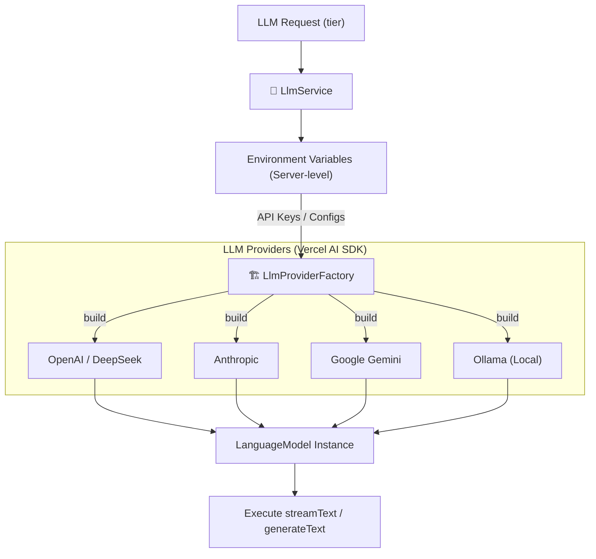
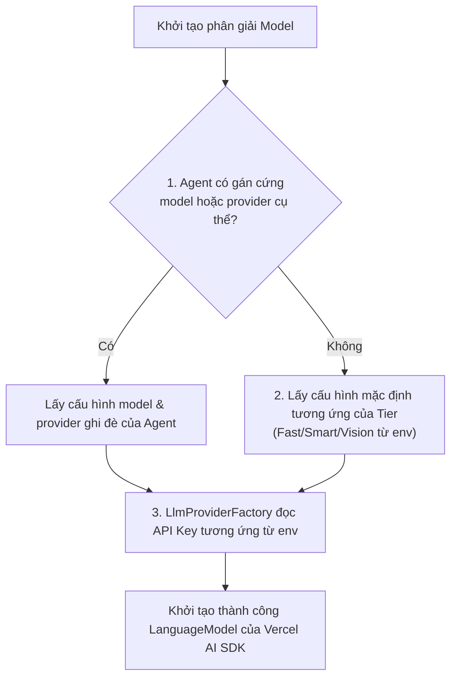

# Layer 4 — LLM Core

> **Mục tiêu**: Hướng dẫn chi tiết thiết kế và triển khai Tầng kết nối LLM (LLM Core) của AgentX. Hỗ trợ đa nhà cung cấp (multi-provider), định tuyến model theo tầng hiệu năng (tiers), tự động xử lý dự phòng (fallback), và giám sát chi phí (metering & cost tracking) bằng cấu hình Platform-level thông qua biến môi trường (environment variables).

---

## 1. Tổng quan thiết kế & Cấu hình Platform-level

AgentX sử dụng cấu hình Server-level (Single-Tenant) cho LLM Core. Toàn bộ thông tin xác thực (API Keys, Base URLs) được quản lý tập trung và nạp trực tiếp qua biến môi trường (environment variables) khi khởi chạy server. 

Hệ thống bọc các SDK của từng nhà cung cấp qua một lớp Provider Factory chung để trả về đối tượng `LanguageModel` tiêu chuẩn của Vercel AI SDK, giúp dễ dàng tích hợp và hoán đổi các nhà cung cấp mô hình mà không làm thay đổi logic nghiệp vụ.



---

## 2. Phân loại Model theo Tier (LlmTier)

Thay vì buộc các subagent hoặc runtime loop phải chọn đích danh tên model (như `claude-3-5-sonnet` hay `gpt-4o`), hệ thống định nghĩa các **Tầng hiệu năng (LlmTier)** để phân bổ tài nguyên hợp lý:

| LlmTier | Định nghĩa & Mục đích sử dụng | Ví dụ Cấu hình Env mặc định |
| :--- | :--- | :--- |
| **`fast`** | Tối ưu về tốc độ và chi phí. Sử dụng cho các tác vụ đơn giản: Phân loại ý định (Intent Classification), tóm tắt nhanh văn bản, hoặc các subagent xử lý tác vụ lặp đi lặp lại có cấu trúc đơn giản. | `LLM_FAST_PROVIDER=openai`<br/>`LLM_FAST_MODEL=gpt-4o-mini` |
| **`smart`** | Tối ưu về khả năng lập luận, lập kế hoạch phức tạp và gọi công cụ (tool use). Sử dụng cho Router Agent chính, các subagent phân tích nghiệp vụ sâu (tài chính, kiểm toán, code). | `LLM_SMART_PROVIDER=anthropic`<br/>`LLM_SMART_MODEL=claude-3-5-sonnet-20241022` |
| **`vision`** | Hỗ trợ xử lý và phân tích hình ảnh/tài liệu đa phương tiện (PDF chứa biểu đồ, hóa đơn dạng ảnh). | `LLM_VISION_PROVIDER=google`<br/>`LLM_VISION_MODEL=gemini-1.5-pro` |

---

## 3. Quy trình Định tuyến & Ghi đè (Model Overrides)

Khi nhận một request thực thi LLM, `LlmService` sẽ định tuyến dựa trên Tier được yêu cầu, kết hợp khả năng cấu hình ghi đè (overrides) của từng Agent cụ thể:



---

## 4. Đo lường Token & Giám sát Chi phí (Metering & Cost Tracking)

Để kiểm soát chi phí API và phục vụ báo cáo Admin, mọi lượt gọi LLM thành công đều đi qua bộ đo lường:
1. **Token Metering**: Ghi nhận số lượng token input, output (và cache read/write đối với Anthropic prompt caching) vào cơ sở dữ liệu hệ thống theo thời gian thực (real-time).
2. **Cost Calculation**: Dựa trên snapshot bảng giá model tại thời điểm gọi, tính toán chi phí thực tế theo USD (`totalUsd = (inputTokens * inputRate) + (outputTokens * outputRate)`) và lưu trữ vĩnh viễn cùng audit log của message. Điều này đảm bảo dữ liệu chi phí lịch sử không bị thay đổi nếu bảng giá model được cập nhật sau này.

---

## 5. Bản thiết kế Mã nguồn (TypeScript Blueprint)

Dưới đây là khung triển khai chi tiết cho LLM Core tại Backend sử dụng NestJS và Vercel AI SDK.

### 5.1 LLM Provider Factory (`LlmProviderFactory`)

`LlmProviderFactory` chịu trách nhiệm khởi tạo các đối tượng `LanguageModel` từ biến môi trường (env) của máy chủ hệ thống.

```typescript
// src/llm/llm-provider.factory.ts
import { Injectable, Logger } from '@nestjs/common';
import { ConfigService } from '@nestjs/config';
import type { LanguageModel } from 'ai';
import { createOpenAI } from '@ai-sdk/openai';
import { createAnthropic } from '@ai-sdk/anthropic';
import { createGoogleGenerativeAI } from '@ai-sdk/google';

export type ProviderName = 'openai' | 'anthropic' | 'google' | 'ollama' | 'deepseek';

export interface LlmBinding {
  model: LanguageModel;
  providerName: ProviderName;
  modelId: string;
}

@Injectable()
export class LlmProviderFactory {
  private readonly logger = new Logger(LlmProviderFactory.name);

  constructor(private readonly config: ConfigService) {}

  /**
   * Khởi tạo đối tượng LanguageModel động từ env credentials của Provider
   */
  async buildProviderModel(provider: string, modelId: string): Promise<LlmBinding> {
    const normalized = provider.toLowerCase() as ProviderName;
    const apiKey = this.resolveEnvCreds(normalized);
    const model = await this.instantiate(normalized, modelId, apiKey);
    return { model, providerName: normalized, modelId };
  }

  private resolveEnvCreds(provider: ProviderName): string {
    switch (provider) {
      case 'openai':
        return this.config.get<string>('OPENAI_API_KEY') || '';
      case 'anthropic':
        return this.config.get<string>('ANTHROPIC_API_KEY') || '';
      case 'google':
        return this.config.get<string>('GOOGLE_GENERATIVE_AI_API_KEY') || '';
      case 'deepseek':
        return this.config.get<string>('DEEPSEEK_API_KEY') || '';
      default:
        throw new Error(`Credentials for provider ${provider} not found in env.`);
    }
  }

  private async instantiate(
    provider: ProviderName,
    modelId: string,
    apiKey: string
  ): Promise<LanguageModel> {
    switch (provider) {
      case 'openai':
      case 'deepseek': // DeepSeek tương thích hoàn toàn với OpenAI Client
        return createOpenAI({
          apiKey,
          baseURL: provider === 'deepseek' ? 'https://api.deepseek.com/v1' : undefined,
        })(modelId);

      case 'anthropic':
        return createAnthropic({
          apiKey,
        })(modelId);

      case 'google':
        return createGoogleGenerativeAI({
          apiKey,
        })(modelId);

      default:
        throw new Error(`Unsupported LLM provider: ${provider}`);
    }
  }
}
```

### 5.2 LLM Service (`LlmService`)

`LlmService` phân giải cấu hình mô hình từ môi trường hoặc theo cấu hình ghi đè của Agent.

```typescript
// src/llm/llm.service.ts
import { Injectable, Logger } from '@nestjs/common';
import { ConfigService } from '@nestjs/config';
import { LlmProviderFactory, LlmBinding } from './llm-provider.factory';
import { TokenMeteringService } from './token-metering.service';
import { CostCalculatorService } from './cost-calculator.service';
import { generateText, streamText } from 'ai';

export type LlmTier = 'fast' | 'smart' | 'vision';

export interface LlmAgentContext {
  agentType: string;
  definition: {
    llmProvider?: string; // Ghi đè provider (nếu có)
    llmModel?: string;    // Ghi đè model cụ thể (nếu có)
  };
}

@Injectable()
export class LlmService {
  private readonly logger = new Logger(LlmService.name);

  constructor(
    private readonly factory: LlmProviderFactory,
    private readonly metering: TokenMeteringService,
    private readonly costCalculator: CostCalculatorService,
    private readonly config: ConfigService
  ) {}

  /**
   * Phân giải model cho Tier tương ứng
   */
  async resolveModel(
    tier: LlmTier,
    agentContext?: LlmAgentContext
  ): Promise<LlmBinding> {
    const def = agentContext?.definition;
    
    // 1. Phân giải cấu hình Tier mặc định từ biến môi trường
    const keyPrefix = tier === 'fast' ? 'LLM_FAST' : tier === 'vision' ? 'LLM_VISION' : 'LLM_SMART';
    let provider = this.config.get<string>(`${keyPrefix}_PROVIDER`) || 'openai';
    let modelId = this.config.get<string>(`${keyPrefix}_MODEL`) || '';

    // 2. Nếu Agent cấu hình ghi đè model/provider cụ thể
    if (def?.llmModel) {
      modelId = def.llmModel;
      if (def.llmProvider) {
        provider = def.llmProvider;
      }
    }

    if (!modelId) {
      throw new Error(`Model for tier ${tier} is not configured.`);
    }

    return this.factory.buildProviderModel(provider, modelId);
  }

  /**
   * Gọi LLM dạng không stream
   */
  async generate(input: {
    tier: LlmTier;
    systemPrompt: string;
    userPrompt: string;
    messages?: any[];
    agentContext?: LlmAgentContext;
  }) {
    const binding = await this.resolveModel(input.tier, input.agentContext);
    const start = Date.now();

    try {
      const result = await generateText({
        model: binding.model,
        system: input.systemPrompt,
        prompt: input.userPrompt,
        messages: input.messages,
      });

      const latencyMs = Date.now() - start;
      const usage = result.usage;

      // Ghi nhận đo lường và tính toán chi phí (bất đồng bộ để không block luồng chính)
      this.recordUsageAndCost(
        binding.providerName,
        binding.modelId,
        usage,
        latencyMs,
        input.agentContext?.agentType
      );

      return {
        text: result.text,
        usage,
        provider: binding.providerName,
        model: binding.modelId,
      };
    } catch (err) {
      this.logger.error(`LLM execution error: ${(err as Error).message}`);
      throw err;
    }
  }

  private async recordUsageAndCost(
    provider: string,
    modelId: string,
    usage: { promptTokens: number; completionTokens: number },
    latencyMs: number,
    agentType?: string
  ) {
    try {
      // 1. Ghi token metering
      await this.metering.recordUsage(
        provider,
        modelId,
        usage.promptTokens,
        usage.completionTokens,
        agentType
      );

      // 2. Tính toán chi phí thực tế lưu vào audit log
      const cost = await this.costCalculator.compute(provider, modelId, {
        input: usage.promptTokens,
        output: usage.completionTokens,
      });

      this.logger.log(`[Usage Log] Model: ${provider}/${modelId} | Cost: $${cost.totalUsd} | Latency: ${latencyMs}ms`);
    } catch (err) {
      this.logger.warn(`Failed to record usage and cost: ${(err as Error).message}`);
    }
  }
}
```

---

*Last updated: 2026-06-06*  
*Version: 0.2.0 — Simplified design for single-tenant / server-level configuration*
