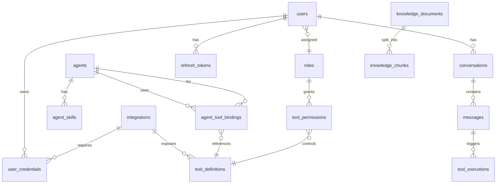

# Layer 6 — Infrastructure

> **Mục tiêu**: Hướng dẫn chi tiết thiết kế và triển khai tầng hạ tầng (Infrastructure) của AgentX — bao gồm Database schema đầy đủ, migration strategy, Redis patterns, caching, observability và health checks.

---

## 1. Database Schema (Full Drizzle ORM)

### 1.1 Tổng quan các bảng



### 1.2 Drizzle Schema Definitions

```typescript
// src/database/schema.ts
import {
  pgTable, uuid, varchar, text, boolean, integer,
  timestamp, jsonb, pgEnum, index, uniqueIndex,
} from 'drizzle-orm/pg-core';
import { relations } from 'drizzle-orm';
import { vector } from 'pgvector/drizzle-orm';

// ─── Enums ───────────────────────────────────────────────

export const roleEnum = pgEnum('role_type', ['ADMIN', 'STAFF']);
export const messageRoleEnum = pgEnum('message_role', ['user', 'assistant', 'system', 'tool']);
export const transportEnum = pgEnum('transport_type', ['sse', 'stdio']);
export const integrationStatusEnum = pgEnum('integration_status', ['active', 'inactive', 'error']);
export const toolExecStatusEnum = pgEnum('tool_exec_status', ['success', 'error', 'denied', 'timeout']);
export const approvalStatusEnum = pgEnum('approval_status', ['pending', 'approved', 'rejected', 'expired']);
export const docStatusEnum = pgEnum('doc_status', ['processing', 'indexed', 'error']);

// ─── Users & Roles ──────────────────────────────────────

export const roles = pgTable('roles', {
  id: uuid('id').primaryKey().defaultRandom(),
  name: varchar('name', { length: 50 }).notNull().unique(),
  description: text('description'),
  createdAt: timestamp('created_at').defaultNow().notNull(),
});

export const users = pgTable('users', {
  id: uuid('id').primaryKey().defaultRandom(),
  email: varchar('email', { length: 255 }).notNull().unique(),
  password: varchar('password', { length: 255 }).notNull(),
  name: varchar('name', { length: 255 }).notNull(),
  roleId: uuid('role_id').notNull().references(() => roles.id),
  isActive: boolean('is_active').default(true).notNull(),
  createdAt: timestamp('created_at').defaultNow().notNull(),
  updatedAt: timestamp('updated_at').defaultNow().notNull(),
}, (table) => [
  index('idx_users_email').on(table.email),
  index('idx_users_role').on(table.roleId),
]);

export const refreshTokens = pgTable('refresh_tokens', {
  id: uuid('id').primaryKey().defaultRandom(),
  userId: uuid('user_id').notNull().references(() => users.id, { onDelete: 'cascade' }),
  tokenHash: varchar('token_hash', { length: 255 }).notNull(),
  userAgent: text('user_agent'),
  expiresAt: timestamp('expires_at').notNull(),
  createdAt: timestamp('created_at').defaultNow().notNull(),
}, (table) => [
  index('idx_refresh_tokens_user').on(table.userId),
]);

// ─── Agents ──────────────────────────────────────────────

export const agents = pgTable('agents', {
  id: uuid('id').primaryKey().defaultRandom(),
  name: varchar('name', { length: 255 }).notNull().unique(),
  systemInstructions: text('system_instructions').notNull(),
  llmProvider: varchar('llm_provider', { length: 50 }),
  llmModel: varchar('llm_model', { length: 100 }),
  tier: varchar('tier', { length: 20 }).default('smart').notNull(),
  isRouter: boolean('is_router').default(false).notNull(),
  maxSteps: integer('max_steps').default(10).notNull(),
  config: jsonb('config').default('{}').notNull(),
  // config JSONB chứa:
  //   routingKeywords: string[]
  //   subagentIds: string[]        (cho Router Agent)
  //   routingStrategy: string      (cho Router Agent)
  //   fallbackResponse: string     (cho Router Agent)
  isActive: boolean('is_active').default(true).notNull(),
  createdAt: timestamp('created_at').defaultNow().notNull(),
  updatedAt: timestamp('updated_at').defaultNow().notNull(),
});

export const agentSkills = pgTable('agent_skills', {
  id: uuid('id').primaryKey().defaultRandom(),
  agentId: uuid('agent_id').notNull().references(() => agents.id, { onDelete: 'cascade' }),
  name: varchar('name', { length: 255 }).notNull(),
  description: text('description'),
  createdAt: timestamp('created_at').defaultNow().notNull(),
}, (table) => [
  index('idx_agent_skills_agent').on(table.agentId),
]);

// ─── Integrations & Tools ────────────────────────────────

export const integrations = pgTable('integrations', {
  id: uuid('id').primaryKey().defaultRandom(),
  name: varchar('name', { length: 255 }).notNull(),
  description: text('description'),
  transport: transportEnum('transport').notNull(),
  endpoint: varchar('endpoint', { length: 1000 }),       // SSE URL
  headers: jsonb('headers').default('{}'),                // Custom headers
  command: varchar('command', { length: 500 }),           // stdio command
  args: jsonb('args').default('[]'),                      // stdio args
  env: jsonb('env').default('{}'),                        // stdio env vars
  authConfig: jsonb('auth_config').default('{}'),
  // authConfig JSONB: { type, oauthAuthorizationUrl, oauthTokenUrl, oauthScopes }
  status: integrationStatusEnum('status').default('active').notNull(),
  lastHealthCheck: timestamp('last_health_check'),
  createdAt: timestamp('created_at').defaultNow().notNull(),
  updatedAt: timestamp('updated_at').defaultNow().notNull(),
});

export const toolDefinitions = pgTable('tool_definitions', {
  id: uuid('id').primaryKey().defaultRandom(),
  integrationId: uuid('integration_id').notNull().references(() => integrations.id, { onDelete: 'cascade' }),
  toolName: varchar('tool_name', { length: 255 }).notNull(),
  description: text('description'),
  inputSchema: jsonb('input_schema').default('{}').notNull(),
  requiresApproval: boolean('requires_approval').default(false).notNull(),
  createdAt: timestamp('created_at').defaultNow().notNull(),
}, (table) => [
  index('idx_tool_defs_integration').on(table.integrationId),
  uniqueIndex('idx_tool_defs_name_unique').on(table.toolName),
]);

export const agentToolBindings = pgTable('agent_tool_bindings', {
  id: uuid('id').primaryKey().defaultRandom(),
  agentId: uuid('agent_id').notNull().references(() => agents.id, { onDelete: 'cascade' }),
  toolDefinitionId: uuid('tool_definition_id').notNull().references(() => toolDefinitions.id, { onDelete: 'cascade' }),
}, (table) => [
  index('idx_agent_tool_bindings_agent').on(table.agentId),
  uniqueIndex('idx_agent_tool_unique').on(table.agentId, table.toolDefinitionId),
]);

export const toolPermissions = pgTable('tool_permissions', {
  id: uuid('id').primaryKey().defaultRandom(),
  roleId: uuid('role_id').notNull().references(() => roles.id, { onDelete: 'cascade' }),
  toolPattern: varchar('tool_pattern', { length: 255 }).notNull(),
  allowed: boolean('allowed').default(true).notNull(),
}, (table) => [
  index('idx_tool_permissions_role').on(table.roleId),
]);

// ─── Conversations & Messages ────────────────────────────

export const conversations = pgTable('conversations', {
  id: uuid('id').primaryKey().defaultRandom(),
  userId: uuid('user_id').notNull().references(() => users.id, { onDelete: 'cascade' }),
  title: varchar('title', { length: 500 }),
  summary: text('summary'),               // Tóm tắt conversation (auto-generated)
  isArchived: boolean('is_archived').default(false).notNull(),
  createdAt: timestamp('created_at').defaultNow().notNull(),
  updatedAt: timestamp('updated_at').defaultNow().notNull(),
}, (table) => [
  index('idx_conversations_user').on(table.userId),
  index('idx_conversations_updated').on(table.updatedAt),
]);

export const messages = pgTable('messages', {
  id: uuid('id').primaryKey().defaultRandom(),
  conversationId: uuid('conversation_id').notNull().references(() => conversations.id, { onDelete: 'cascade' }),
  role: messageRoleEnum('role').notNull(),
  content: text('content').notNull(),
  routedAgentId: uuid('routed_agent_id').references(() => agents.id),
  tokenCount: integer('token_count'),
  metadata: jsonb('metadata').default('{}'),
  // metadata JSONB: { toolCalls, approvalInfo, authRequired, etc. }
  createdAt: timestamp('created_at').defaultNow().notNull(),
}, (table) => [
  index('idx_messages_conversation').on(table.conversationId),
  index('idx_messages_created').on(table.createdAt),
]);

export const toolExecutions = pgTable('tool_executions', {
  id: uuid('id').primaryKey().defaultRandom(),
  messageId: uuid('message_id').notNull().references(() => messages.id, { onDelete: 'cascade' }),
  toolDefinitionId: uuid('tool_definition_id').references(() => toolDefinitions.id),
  toolName: varchar('tool_name', { length: 255 }).notNull(),
  input: jsonb('input').default('{}'),
  output: jsonb('output').default('{}'),
  status: toolExecStatusEnum('status').notNull(),
  errorMessage: text('error_message'),
  durationMs: integer('duration_ms'),
  executedAt: timestamp('executed_at').defaultNow().notNull(),
}, (table) => [
  index('idx_tool_exec_message').on(table.messageId),
  index('idx_tool_exec_status').on(table.status),
  index('idx_tool_exec_date').on(table.executedAt),
]);

// ─── Approval Requests ───────────────────────────────────

export const approvalRequests = pgTable('approval_requests', {
  id: uuid('id').primaryKey().defaultRandom(),
  conversationId: uuid('conversation_id').notNull().references(() => conversations.id),
  userId: uuid('user_id').notNull().references(() => users.id),
  toolName: varchar('tool_name', { length: 255 }).notNull(),
  args: jsonb('args').default('{}'),
  description: text('description'),
  status: approvalStatusEnum('status').default('pending').notNull(),
  decidedAt: timestamp('decided_at'),
  createdAt: timestamp('created_at').defaultNow().notNull(),
}, (table) => [
  index('idx_approval_conversation').on(table.conversationId),
  index('idx_approval_status').on(table.status),
]);

// ─── User Credentials (for MCP User-scoped auth) ────────

export const userCredentials = pgTable('user_credentials', {
  id: uuid('id').primaryKey().defaultRandom(),
  userId: uuid('user_id').notNull().references(() => users.id, { onDelete: 'cascade' }),
  integrationId: uuid('integration_id').notNull().references(() => integrations.id, { onDelete: 'cascade' }),
  encryptedToken: text('encrypted_token').notNull(),
  refreshToken: text('refresh_token'),
  expiresAt: timestamp('expires_at'),
  createdAt: timestamp('created_at').defaultNow().notNull(),
  updatedAt: timestamp('updated_at').defaultNow().notNull(),
}, (table) => [
  uniqueIndex('idx_user_cred_unique').on(table.userId, table.integrationId),
]);

// ─── LLM Usage Logs ──────────────────────────────────────

export const llmUsageLogs = pgTable('llm_usage_logs', {
  id: uuid('id').primaryKey().defaultRandom(),
  messageId: uuid('message_id').references(() => messages.id),
  agentId: uuid('agent_id').references(() => agents.id),
  provider: varchar('provider', { length: 50 }).notNull(),
  model: varchar('model', { length: 100 }).notNull(),
  tier: varchar('tier', { length: 20 }),
  promptTokens: integer('prompt_tokens').notNull(),
  completionTokens: integer('completion_tokens').notNull(),
  totalTokens: integer('total_tokens').notNull(),
  costUsd: varchar('cost_usd', { length: 20 }),       // Frozen cost at time of call
  latencyMs: integer('latency_ms'),
  createdAt: timestamp('created_at').defaultNow().notNull(),
}, (table) => [
  index('idx_llm_usage_agent').on(table.agentId),
  index('idx_llm_usage_date').on(table.createdAt),
  index('idx_llm_usage_provider').on(table.provider),
]);

// ─── Knowledge Base ──────────────────────────────────────

export const knowledgeDocuments = pgTable('knowledge_documents', {
  id: uuid('id').primaryKey().defaultRandom(),
  title: varchar('title', { length: 500 }).notNull(),
  sourceType: varchar('source_type', { length: 50 }).notNull(),
  originalFilename: varchar('original_filename', { length: 500 }),
  totalChunks: integer('total_chunks').default(0),
  status: docStatusEnum('status').default('processing').notNull(),
  uploadedBy: uuid('uploaded_by').references(() => users.id),
  createdAt: timestamp('created_at').defaultNow().notNull(),
  updatedAt: timestamp('updated_at').defaultNow().notNull(),
});

export const knowledgeChunks = pgTable('knowledge_chunks', {
  id: uuid('id').primaryKey().defaultRandom(),
  documentId: uuid('document_id').notNull().references(() => knowledgeDocuments.id, { onDelete: 'cascade' }),
  chunkIndex: integer('chunk_index').notNull(),
  content: text('content').notNull(),
  embedding: vector('embedding', { dimensions: 1536 }).notNull(),
  tokenCount: integer('token_count'),
  metadata: jsonb('metadata').default('{}'),
  createdAt: timestamp('created_at').defaultNow().notNull(),
}, (table) => [
  index('idx_chunks_document').on(table.documentId),
]);
```

---

## 2. Migration Strategy

### 2.1 Drizzle Kit Workflow

```bash
# 1. Tạo migration từ schema changes
pnpm drizzle-kit generate

# 2. Apply migrations lên database
pnpm drizzle-kit migrate

# 3. Push trực tiếp (chỉ dùng cho dev)
pnpm drizzle-kit push

# 4. Xem trạng thái migrations
pnpm drizzle-kit status
```

### 2.2 Drizzle Config

```typescript
// drizzle.config.ts
import { defineConfig } from 'drizzle-kit';

export default defineConfig({
  schema: './src/database/schema.ts',
  out: './src/database/migrations',
  dialect: 'postgresql',
  dbCredentials: {
    host: process.env.DATABASE_HOST || 'localhost',
    port: Number(process.env.DATABASE_PORT) || 5432,
    user: process.env.DATABASE_USER || 'agentx_user',
    password: process.env.DATABASE_PASSWORD || '',
    database: process.env.DATABASE_NAME || 'agentx_db',
  },
});
```

### 2.3 pgvector Extension

pgvector cần được enable trước khi chạy migration:

```sql
-- Chạy 1 lần khi tạo database
CREATE EXTENSION IF NOT EXISTS vector;
```

Có thể tự động hóa trong seed script:

```typescript
async function enableExtensions(db: NodePgDatabase) {
  await db.execute(sql`CREATE EXTENSION IF NOT EXISTS vector`);
  await db.execute(sql`CREATE EXTENSION IF NOT EXISTS "uuid-ossp"`);
}
```

---

## 3. Redis Patterns

### 3.1 Key Structure

```
agentx:                              # Namespace prefix
├── session:{conversationId}:messages  # Conversation buffer (CoreMessage[])
├── config:agents                      # Cached agent configs
├── config:integrations                # Cached integration configs  
├── config:permissions:{roleId}        # Cached tool permissions
├── rate:{userId}:{window}             # Rate limiting counters
└── user:{userId}:token                # Cached access token validation
```

### 3.2 Rate Limiting (Sliding Window)

```typescript
// src/common/guards/rate-limit.guard.ts
@Injectable()
export class RateLimitGuard implements CanActivate {
  constructor(private readonly redis: RedisService) {}

  async canActivate(context: ExecutionContext): Promise<boolean> {
    const request = context.switchToHttp().getRequest();
    const userId = request.user.id;
    const key = `agentx:rate:${userId}:${this.getWindowKey()}`;

    const current = await this.redis.incr(key);
    if (current === 1) {
      await this.redis.expire(key, 60); // 1 minute window
    }

    const limit = 30; // 30 requests per minute
    if (current > limit) {
      throw new HttpException('Rate limit exceeded', 429);
    }

    return true;
  }

  private getWindowKey(): string {
    return Math.floor(Date.now() / 60000).toString(); // 1-minute window
  }
}
```

### 3.3 Config Hot-Reload (Pub/Sub)

```typescript
// src/redis/config-pubsub.service.ts
@Injectable()
export class ConfigPubSubService implements OnModuleInit {
  private readonly CHANNEL = 'agentx:config:invalidated';

  constructor(
    private readonly redis: RedisService,
    private readonly agentRegistry: AgentRegistryService,
    private readonly integrationManager: IntegrationManagerService,
  ) {}

  async onModuleInit() {
    // Subscribe to config changes
    await this.redis.subscribe(this.CHANNEL, async (message) => {
      const { type } = JSON.parse(message);
      switch (type) {
        case 'agent':
          await this.agentRegistry.reloadFromDB();
          break;
        case 'integration':
          await this.integrationManager.reinitialize();
          break;
        case 'permission':
          // Clear all permission caches
          const keys = await this.redis.keys('agentx:config:permissions:*');
          if (keys.length) await this.redis.del(...keys);
          break;
      }
    });
  }

  async publishInvalidation(type: 'agent' | 'integration' | 'permission') {
    await this.redis.publish(this.CHANNEL, JSON.stringify({
      type,
      timestamp: Date.now(),
    }));
  }
}
```

---

## 4. Caching Strategy

| Data Type | TTL | Invalidation |
|-----------|-----|-------------|
| Agent configs | 5 min | On admin save → pub/sub invalidate |
| Integration configs | 5 min | On admin save → pub/sub invalidate |
| Tool permissions | 10 min | On admin save → pub/sub invalidate |
| Conversation buffer | 24h | On new message → refresh TTL |
| User session | 15 min (access token lifetime) | On logout → delete |
| Rate limit counters | 1 min | Auto-expire |

---

## 5. Observability

### 5.1 OpenTelemetry Setup

```typescript
// src/common/telemetry/tracing.ts
import { NodeSDK } from '@opentelemetry/sdk-node';
import { getNodeAutoInstrumentations } from '@opentelemetry/auto-instrumentations-node';
import { OTLPTraceExporter } from '@opentelemetry/exporter-trace-otlp-http';

const sdk = new NodeSDK({
  traceExporter: new OTLPTraceExporter({
    url: process.env.OTEL_EXPORTER_OTLP_ENDPOINT || 'http://localhost:4318/v1/traces',
  }),
  instrumentations: [
    getNodeAutoInstrumentations({
      '@opentelemetry/instrumentation-pg': { enabled: true },
      '@opentelemetry/instrumentation-redis': { enabled: true },
      '@opentelemetry/instrumentation-http': { enabled: true },
    }),
  ],
});

sdk.start();
```

### 5.2 Structured Logging

```typescript
// src/common/logger/structured-logger.ts
import { LoggerService } from '@nestjs/common';

export class StructuredLogger implements LoggerService {
  log(message: string, context?: any) {
    console.log(JSON.stringify({
      level: 'info',
      message,
      context,
      timestamp: new Date().toISOString(),
      service: 'agentx-api',
    }));
  }

  error(message: string, trace?: string, context?: any) {
    console.error(JSON.stringify({
      level: 'error',
      message,
      trace,
      context,
      timestamp: new Date().toISOString(),
      service: 'agentx-api',
    }));
  }

  warn(message: string, context?: any) {
    console.warn(JSON.stringify({
      level: 'warn',
      message,
      context,
      timestamp: new Date().toISOString(),
      service: 'agentx-api',
    }));
  }
}
```

### 5.3 Key Metrics to Monitor

| Metric | Source | Alert Threshold |
|--------|--------|----------------|
| LLM cost (USD/hour) | `llm_usage_logs` | > $10/hour |
| Tool execution error rate | `tool_executions` | > 5% in 5min |
| API response time (P95) | OpenTelemetry | > 2000ms |
| MCP connection failures | Integration Manager | > 3 consecutive |
| Active conversations | `conversations` | Informational |
| Redis memory usage | Redis INFO | > 80% maxmemory |
| PostgreSQL connections | pg_stat_activity | > 80% max_connections |

---

## 6. Health Check Endpoints

```typescript
// src/common/health/health.controller.ts
@Controller('health')
export class HealthController {
  constructor(
    @Inject(DRIZZLE_PROVIDER) private readonly db: NodePgDatabase,
    private readonly redis: RedisService,
  ) {}

  /**
   * GET /api/health — Kiểm tra sức khỏe toàn hệ thống
   */
  @Get()
  async healthCheck() {
    const checks = {
      status: 'ok',
      timestamp: new Date().toISOString(),
      uptime: process.uptime(),
      checks: {
        database: await this.checkDatabase(),
        redis: await this.checkRedis(),
      },
    };

    const allHealthy = Object.values(checks.checks).every(c => c.status === 'ok');
    checks.status = allHealthy ? 'ok' : 'degraded';

    return checks;
  }

  private async checkDatabase() {
    try {
      await this.db.execute(sql`SELECT 1`);
      return { status: 'ok' };
    } catch (error) {
      return { status: 'error', message: (error as Error).message };
    }
  }

  private async checkRedis() {
    try {
      await this.redis.ping();
      return { status: 'ok' };
    } catch (error) {
      return { status: 'error', message: (error as Error).message };
    }
  }
}
```

**Response mẫu:**

```json
{
  "status": "ok",
  "timestamp": "2026-06-06T15:00:00.000Z",
  "uptime": 86400,
  "checks": {
    "database": { "status": "ok" },
    "redis": { "status": "ok" }
  }
}
```

---

*Last updated: 2026-06-06*
*Version: 0.1.0 — Initial Infrastructure spec*
