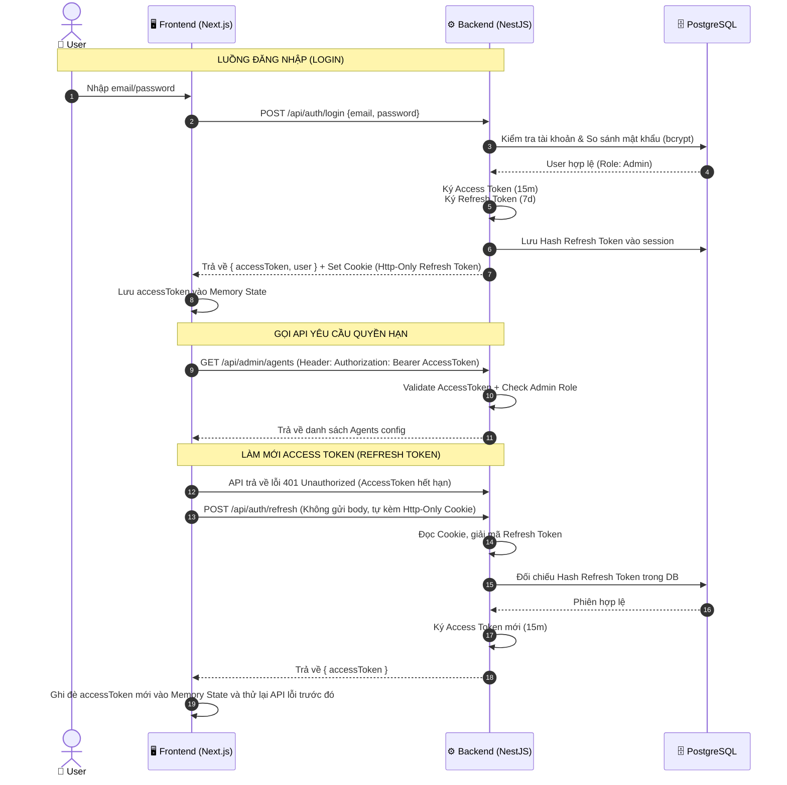

# Source Code Structure & Setup Guide

Tài liệu này hướng dẫn chi tiết về cách cấu trúc mã nguồn theo hướng **Feature-based** (tập trung theo tính năng), cách cài đặt frontend với **HeroUI 3** và cơ chế xác thực **JWT (JSON Web Token)** mặc định cùng với việc tự động tạo tài khoản Admin khi khởi tạo hệ thống.

---

## 1. Feature-Based Architecture (Cấu trúc theo tính năng)

Dự án AgentX áp dụng mô hình Feature-based cho cả Backend và Frontend nhằm tăng khả năng bảo trì, cô lập các lỗi và giúp các đội phát triển làm việc song song mà ít bị xung đột code (conflict).

### 1.1 Backend (NestJS + TypeScript)
Thư mục `apps/api/` được tổ chức thành các Module tự chứa (Self-contained Modules). Mỗi module đại diện cho một tính năng/domain nghiệp vụ riêng, bao gồm đầy đủ controller, service, entities, DTOs và guards liên quan.

#### Sơ đồ cấu trúc thư mục Backend:
```
apps/api/
├── src/
│   ├── app.module.ts              # Module gốc kết nối tất cả các modules
│   ├── main.ts                    # Entry point của ứng dụng NestJS
│   │
│   ├── common/                    # Các thành phần dùng chung toàn hệ thống
│   │   ├── decorators/            # Custom decorators (e.g., @CurrentUser, @Roles)
│   │   ├── filters/               # Exception filters xử lý lỗi tập trung
│   │   ├── guards/                # Global guards hoặc shared guards
│   │   ├── interceptors/          # Logging, transform response interceptors
│   │   └── interfaces/            # Types/Interfaces dùng chung
│   │
│   ├── config/                    # Cấu hình hệ thống (Environment Variables validation)
│   │   ├── configuration.ts
│   │   └── env.validation.ts
│   │
│   ├── database/                  # Tầng kết nối Database (Drizzle ORM)
│   │   ├── database.module.ts     # Khởi tạo DrizzleModule & DrizzleProvider
│   │   ├── drizzle.provider.ts    # Provider kết nối PostgreSQL (pg client)
│   │   ├── schema.ts              # Trung tâm định nghĩa và export toàn bộ các bảng db
│   │   └── seeds/                 # Scripts seed dữ liệu ban đầu (Tạo Admin Account)
│   │       └── admin-seeding.ts
│   │
│   ├── redis/                     # Shared Redis module (Caching, Session management)
│   │   ├── redis.module.ts
│   │   └── redis.service.ts
│   │
│   └── features/                  # Danh sách các modules tính năng (Feature-based)
│       ├── auth/                  # Tính năng xác thực & phân quyền
│       │   ├── dto/               # LoginDto, RegisterDto
│       │   ├── guards/            # JwtAuthGuard, RolesGuard
│       │   ├── strategies/        # JwtStrategy (Passport)
│       │   ├── auth.controller.ts
│       │   ├── auth.service.ts
│       │   └── auth.module.ts
│       │
│       ├── users/                 # Quản lý người dùng và vai trò (RBAC)
│       │   ├── dto/
│       │   ├── users.schema.ts    # Drizzle schema cho bảng users và roles
│       │   ├── users.controller.ts
│       │   ├── users.service.ts
│       │   └── users.module.ts
│       │
│       ├── agents/                # Quản lý Agent & Subagent Config (Layer 0 & 2)
│       │   ├── dto/
│       │   ├── agents.schema.ts   # Drizzle schema cho bảng agents và skills
│       │   ├── agents.controller.ts
│       │   ├── agents.service.ts
│       │   └── agents.module.ts
│       │
│       ├── conversations/         # Quản lý Session chat và lịch sử hội thoại (Layer 3)
│       │   ├── dto/
│       │   ├── conversations.schema.ts # Drizzle schema cho conversations, messages
│       │   ├── conversations.controller.ts
│       │   ├── conversations.service.ts
│       │   └── conversations.module.ts
│       │
│       ├── integrations/          # Quản lý kết nối MCP Server & API Adapters (Layer 5)
│       │   ├── dto/
│       │   ├── integrations.schema.ts # Drizzle schema cho integrations và tool definitions
│       │   ├── mcp-client.pool.ts # Quản lý kết nối MCP Client
│       │   ├── integrations.controller.ts
│       │   ├── integrations.service.ts
│       │   └── integrations.module.ts
│       │
│       └── llm/                   # Quản lý kết nối LLM Providers (Layer 4)
│           ├── llm-provider.factory.ts
│           ├── llm.service.ts
│           ├── token-metering.service.ts
│           └── llm.module.ts
```

#### Quy tắc thiết kế Backend:
1. **Tính độc lập**: Các module trong `features/` không được import trực tiếp các file logic nội bộ của module khác. Nếu cần giao tiếp, hãy import module đó hoặc sử dụng các Dependency Injection thông qua Interface/Service được export công khai.
2. **Không viết logic trong Controller**: Controller chỉ làm nhiệm vụ tiếp nhận HTTP requests, validate input thông qua DTOs/ValidationPipes, gọi service và trả về kết quả. Toàn bộ Business Logic phải nằm trong Service.

---

### 1.2 Frontend (Next.js 15 + App Router)
Thư mục `apps/web/` được tổ chức tối ưu theo App Router của Next.js 15, kết hợp với cấu trúc Feature-based để phân chia các trang và logic nghiệp vụ.

#### Sơ đồ cấu trúc thư mục Frontend:
```
apps/web/
├── public/                        # Static assets (images, fonts, icons)
├── src/
│   ├── app/                       # Routing Layer (Next.js App Router)
│   │   ├── (auth)/                # Route Group cho các trang xác thực
│   │   │   ├── login/
│   │   │   │   └── page.tsx       # Trang đăng nhập
│   │   │   └── layout.tsx
│   │   ├── (dashboard)/           # Route Group cho hệ thống Chat & Admin Panel
│   │   │   ├── admin/
│   │   │   │   ├── agents/        # Quản lý Agents
│   │   │   │   ├── integrations/  # Quản lý MCP Servers
│   │   │   │   └── page.tsx       # Tổng quan Admin Panel
│   │   │   ├── chat/
│   │   │   │   └── page.tsx       # Giao diện Chat chính với AI Agents
│   │   │   └── layout.tsx         # Sidebar, Navbar dùng chung
│   │   ├── globals.css            # CSS toàn cục & Tailwind v4
│   │   ├── layout.tsx             # Root layout cấu hình HTML/Body
│   │   └── providers.tsx          # Wrapper cho HeroUIProvider, AuthProvider
│   │
│   ├── components/                # Shared Components (Chỉ chứa UI Components dùng chung)
│   │   ├── ui/                    # Wrapper tùy biến các component từ HeroUI
│   │   │   ├── button.tsx
│   │   │   ├── input.tsx
│   │   │   └── modal.tsx
│   │   └── layout/                # Sidebar, Header, Footer
│   │
│   ├── config/                    # Config constants, env
│   ├── hooks/                     # Shared Custom Hooks (e.g., useLocalStorage)
│   ├── lib/                       # Khởi tạo các SDK client (axios, socket.io client)
│   │   └── api-client.ts
│   │
│   ├── types/                     # TypeScript definitions toàn cục
│   │
│   └── features/                  # Feature Modules (Chứa logic và components riêng)
│       ├── auth/                  # Feature Login/Logout
│       │   ├── components/        # LoginForm component
│       │   ├── hooks/             # useAuth hook quản lý token
│       │   ├── services/          # Các hàm gọi API đăng nhập, logout
│       │   └── auth-store.ts      # State management (Zustand/Jotai) của auth
│       │
│       ├── chat-session/          # Feature hội thoại với Agent
│       │   ├── components/        # ChatWindow, MessageBubble, TypingIndicator
│       │   ├── hooks/             # useChatStream (nhận token real-time)
│       │   └── services/
│       │
│       └── agent-admin/           # Feature cấu hình Agent dành cho Admin
│           ├── components/        # AgentForm, ToolSelector, ServerConfigForm
│           └── services/
```

#### Quy tắc thiết kế Frontend:
1. **App Directory mỏng**: Thư mục `src/app/` chỉ nên chứa các file `page.tsx` và `layout.tsx` đóng vai trò là "điểm ghép nối" (view template). Logic nghiệp vụ thực tế, state, và các component phức tạp nên được đưa vào `src/features/`.
2. **Feature Encapsulation**: Một components nằm trong `src/features/auth/` không được import trực tiếp components của `src/features/chat-session/`. Mọi sự chia sẻ components chung bắt buộc phải thông qua thư mục `src/components/`.

---

## 2. Hướng dẫn thiết lập Frontend với HeroUI 3

**HeroUI 3** là thư viện UI hiện đại, xây dựng trên nền tảng Tailwind CSS v4 và React 19, cung cấp các hiệu ứng chuyển động mượt mà bằng Framer Motion.

### 2.1 Cài đặt Dependencies
Trong thư mục `apps/web/`, cài đặt các package chính thức:

```bash
pnpm add @heroui/react @heroui/styles framer-motion
```

*(Lưu ý: HeroUI 3 yêu cầu React 19 và Tailwind CSS v4 làm mặc định).*

### 2.2 Cấu hình Tailwind CSS v4
Tailwind v4 đơn giản hóa việc cấu hình bằng cách import trực tiếp trong CSS file thay vì sử dụng file `tailwind.config.js` cũ.

Trong file `src/app/globals.css`:
```css
@import "tailwindcss";
@import "@heroui/styles";

/* Có thể định nghĩa thêm các custom CSS variables hoặc theme của HeroUI tại đây */
@theme {
  --color-brand-primary: #10b981;
  --color-brand-dark: #0f172a;
}
```

### 2.3 Cấu hình Provider
Do các trang trong Next.js App Router mặc định là Server Components (RSC), ta cần bọc ứng dụng trong một Client Component Provider để cung cấp ngữ cảnh (context) cho HeroUI và đồng thời cấu hình chuyển trang mượt mà (Client-side routing).

Tạo file `src/app/providers.tsx`:
```tsx
"use client";

import * as React from "react";
import { HeroUIProvider } from "@heroui/react";
import { useRouter } from "next/navigation";

export function Providers({ children }: { children: React.ReactNode }) {
  const router = useRouter();

  return (
    <HeroUIProvider navigate={router.push}>
      {children}
    </HeroUIProvider>
  );
}
```

Tích hợp vào `src/app/layout.tsx`:
```tsx
import { Providers } from "./providers";
import "./globals.css";

export const metadata = {
  title: "AgentX — Platform",
  description: "Enterprise Multi-Agent Platform",
};

export default function RootLayout({
  children,
}: {
  children: React.ReactNode;
}) {
  return (
    <html lang="vi" className="dark">
      <body className="min-h-screen bg-background text-foreground antialiased">
        <Providers>
          {children}
        </Providers>
      </body>
    </html>
  );
}
```

---

## 3. Cơ chế Xác thực & Phân quyền (JWT Authentication)

Hệ thống AgentX sử dụng cơ chế xác thực dựa trên **JSON Web Token (JWT)** tự quản lý (Self-hosted JWT) để đảm bảo tốc độ xử lý nhanh, bảo mật và hoàn toàn độc lập với các nhà cung cấp dịch vụ bên thứ ba.

### 3.1 Chiến lược quản lý Token (Token Strategy)
Để cân bằng giữa trải nghiệm người dùng và tính bảo mật, hệ thống áp dụng cơ chế **Dual-Token**:

1. **Access Token (Ngắn hạn)**:
   - Thời gian sống: **15 phút**.
   - Chứa thông tin cơ bản: `userId`, `email`, `role` (Admin hoặc Staff).
   - Phía Frontend: Lưu trữ Access Token trong **Memory** (biến cục bộ của state manager) để tránh các cuộc tấn công XSS đánh cắp token.
   - Gửi kèm HTTP request qua Header: `Authorization: Bearer <access_token>`.

2. **Refresh Token (Dài hạn)**:
   - Thời gian sống: **7 ngày**.
   - Phía Backend: Lưu mã băm (hash) của Refresh Token trong Database cùng với thông tin thiết bị (user-agent) để hỗ trợ tính năng đăng xuất từ xa hoặc hủy phiên.
   - Phía Frontend: Backend tự động ghi đè Refresh Token vào trình duyệt của user thông qua **HTTP-Only, Secure, SameSite=Strict Cookie**. Cách này giúp bảo vệ Refresh Token khỏi các script XSS độc hại.

### 3.2 Luồng xử lý Đăng nhập & Làm mới Token (Auth Flow)



---

## 4. Tự động khởi tạo Tài khoản Admin (Admin Seeding)

Để đảm bảo hệ thống có thể hoạt động ngay lập tức sau khi triển khai và người quản trị có tài khoản để cấu hình hệ thống, Backend triển khai một script tự động seed tài khoản admin mặc định khi ứng dụng khởi chạy lần đầu.

### 4.1 Logics hoạt động của Seed script (NestJS)
Script này sẽ chạy trong quá trình khởi tạo Database (Migration) hoặc được gọi thông qua hook `onApplicationBootstrap` của NestJS.

```typescript
// src/database/seeds/admin-seeding.ts
import { Injectable, OnApplicationBootstrap, Logger, Inject } from '@nestjs/common';
import { NodePgDatabase } from 'drizzle-orm/node-postgres';
import { DRIZZLE_PROVIDER } from '../drizzle.provider';
import * as schema from '../schema';
import { eq } from 'drizzle-orm';
import * as bcrypt from 'bcrypt';

@Injectable()
export class DatabaseSeeder implements OnApplicationBootstrap {
  private readonly logger = new Logger(DatabaseSeeder.name);

  constructor(
    @Inject(DRIZZLE_PROVIDER)
    private readonly db: NodePgDatabase<typeof schema>,
  ) {}

  async onApplicationBootstrap() {
    this.logger.log('Đang kiểm tra dữ liệu khởi tạo...');
    await this.seedRoles();
    await this.seedAdminUser();
  }

  private async seedRoles() {
    const roles = [
      { name: 'ADMIN', description: 'Vai trò ADMIN' },
      { name: 'STAFF', description: 'Vai trò STAFF' },
    ];
    for (const roleData of roles) {
      const exists = await this.db.query.roles.findFirst({
        where: eq(schema.roles.name, roleData.name),
      });
      if (!exists) {
        await this.db.insert(schema.roles).values(roleData);
        this.logger.log(`Đã khởi tạo vai trò: ${roleData.name}`);
      }
    }
  }

  private async seedAdminUser() {
    const adminEmail = process.env.ADMIN_DEFAULT_EMAIL || 'admin@agentx.local';
    const adminPassword = process.env.ADMIN_DEFAULT_PASSWORD || 'Admin@123456';

    const adminExists = await this.db.query.users.findFirst({
      where: eq(schema.users.email, adminEmail),
    });

    if (!adminExists) {
      // 1. Tìm vai trò ADMIN
      const adminRole = await this.db.query.roles.findFirst({
        where: eq(schema.roles.name, 'ADMIN'),
      });
      if (!adminRole) {
        throw new Error('Không tìm thấy vai trò ADMIN để liên kết.');
      }

      // 2. Mã hóa mật khẩu
      const salt = await bcrypt.genSalt(10);
      const hashedPassword = await bcrypt.hash(adminPassword, salt);

      // 3. Tạo tài khoản
      await this.db.insert(schema.users).values({
        email: adminEmail,
        password: hashedPassword,
        name: 'System Administrator',
        roleId: adminRole.id,
        isActive: true,
      });

      this.logger.warn('====================================================');
      this.logger.warn(`TÀI KHOẢN ADMIN MẶC ĐỊNH ĐÃ ĐƯỢC KHỞI TẠO!`);
      this.logger.warn(`Email: ${adminEmail}`);
      this.logger.warn(`Password: ${adminPassword} (Vui lòng đổi mật khẩu sau khi đăng nhập)`);
      this.logger.warn('====================================================');
    } else {
      this.logger.log('Tài khoản Admin đã tồn tại. Bỏ qua bước seed user.');
    }
  }
}
```

### 4.2 Cấu hình môi trường cho tài khoản Admin
Các tham số cấu hình tài khoản admin được khai báo trong file môi trường `.env` của backend:

```env
# Default Admin Credentials
ADMIN_DEFAULT_EMAIL=admin@agentx.local
ADMIN_DEFAULT_PASSWORD=Admin@123456

# JWT Secrets
JWT_ACCESS_SECRET=your_jwt_access_secret_key_should_be_long_and_secure_123
JWT_REFRESH_SECRET=your_jwt_refresh_secret_key_should_be_long_and_secure_456
```
